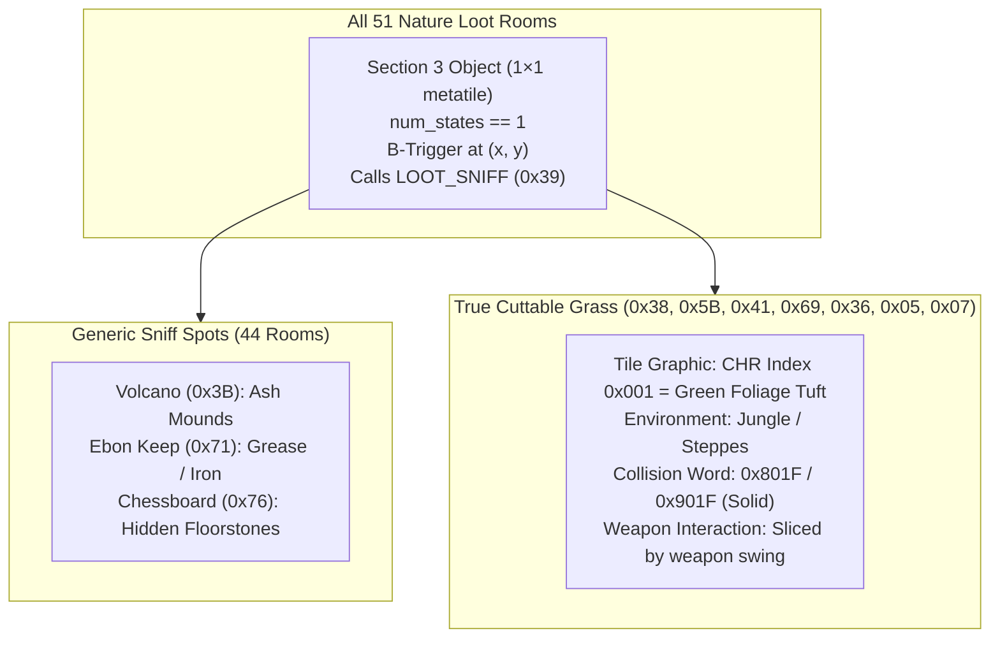

# Identification and Mechanics of Cuttable Grass Patches in Secret of Evermore

This document provides a comprehensive technical breakdown of how **cuttable grass patches, foliage obstacles, and nature loot spots** operate in *Secret of Evermore*, based on empirical reverse-engineering of ROM map structures, collision matrices, CHR tilebanks, Section 3 dynamic objects, and B-trigger scripts.

---

## 1. Executive Summary: What Distinguishes Cuttable Grass?

When exploring maps such as **`0x38` (South Jungle), `0x5B` (East Jungle), `0x41` (North Jungle), `0x69` (Volcano Path), `0x36` (Fire Pits), `0x05` (Antiqua Fields), and `0x07` (West of Crustacia)**, visible grass patches and foliage tufts appear on walkable paths. When struck with a weapon swing or sniffed by the Dog, these patches slice apart with a particle effect and can yield alchemy ingredients (Water, Roots, Petals, etc.).

### Why Other Maps with 1×1 Sniff Objects Do NOT Have Cuttable Grass
An automated scan of Section 3 objects finds 51 rooms with $1 \times 1$ interactive objects. However, maps like **Volcano Interior (`0x3B`), Ebon Keep (`0x71`), Blimp Exterior (`0x16`), and the Chessboard Maze (`0x76`) do NOT contain cuttable grass**.

This distinction is fundamental:
- **Generic Sniff Spots / Nature Loot (All 51 Rooms):** Use Section 3 $1 \times 1$ objects to mark persistent loot locations. In a volcano they represent ash piles; in a castle they represent grease/iron; in a dungeon they represent loose floorstones.
- **True Cuttable Grass Patches (The 7 Core Maps):** Specifically require **Jungle or Steppe CHR tilebanks** where Tile `#1` contains the green grass tuft graphic, placed on grassy terrain where weapon swing hitboxes interact with the patch.

---

## 2. The Tri-Part Signature of Cuttable Grass

To programmatically identify true cuttable grass patches, three criteria must be met simultaneously:

### 2.1 The Tile Property: CHR Tile Index `0x001`
The Section 3 stamping block specifies a $1 \times 1$ metatile using **Character Index `0x001`**:

$$\text{Tile Word} = (\text{V-Flip} \ll 15) \mid (\text{H-Flip} \ll 14) \mid (\text{Palette} \ll 10) \mid \mathbf{0x0001}$$

- **Tile Values Observed:** `0x0001`, `0x0801`, `0x1801`, `0x2801`, `0x5001`, `0x7801`, `0x8001`, `0x8801`, `0x9801`, `0xA001`, `0xD801`, `0xF801`.
- **Mask Check:** `(tile_word & 0x03FF) == 0x0001`.
- **Underlying Background:** Prior to object stamping, the Layer 1 planar grid at the patch coordinate is `0xA800` (transparent/empty space). The engine stamps Tile `0x001` when loading the room, and restores `0xA800` when the grass is cut or harvested.

### 2.2 The Collision Property: `0x801F` and `0x901F`
In Block 3 Slice 2 (collision matrix), grass patches are marked with high-bit object reservation flags and solid passability:
- **Prehistorica (Rooms `0x38`, `0x5B`, `0x41`):** `0x801F` (or `0x821F`).
- **Antiqua & Volcano Path (Rooms `0x69`, `0x36`, `0x05`, `0x07`):** `0x901F`.
- **Bit 15 (`0x8000`):** Indicates dynamic Section 3 object destination.
- **Bits 0..3 (`0x0F`):** Solid blocking boundary (stops the player until sliced).

### 2.3 The Object & Trigger Property: Section 3 Descriptor
- **Footprint:** Strictly `target_width == 1` and `target_height == 1` ($16 \times 16$ pixels).
- **Trigger:** Paired with a $1 \times 1$ B-trigger at `(tile_x, tile_y)` running a script that calls `LOOT_SNIFF` (`0x39`) and updates a persistent loot bit in WRAM (`$2258..$23FF`).

---

## 3. Do We Need a Trace of Cutting Grass?

**Yes.** A debugger trace in Mesen2 during the exact frame a weapon strikes a grass patch is necessary to resolve three low-level engine behaviors that static disassembly cannot fully prove:

### 3.1 What the Trace Will Clarify

1. **Weapon Hitbox Detection (ASM vs. Script VM):**
   - Does player weapon swinging poll B-triggers natively in 65c816 code (treating the weapon swing as a spatial B-press)?
   - Or does the weapon hitbox routine specifically query the Block 3 Slice 2 collision word to detect `0x801F`/`0x901F` directly?
2. **VRAM and Collision Unloading Sequence:**
   - When grass is cut, does the engine execute the general Section 3 object unloader (`$90A5D0`), or does a specialized combat routine overwrite the WRAM collision matrix from `0x801F` to `0x0010` (walkable)?
   - If collision is modified directly in WRAM, tracing will pinpoint the exact routine responsible for restoring passability.
3. **Particle Effect Spawning:**
   - Tracing will capture the entity slot allocation (`$7E1000..$7E1FFF`) that spawns the flying green leaf particles and sound effect (`SFX.CHOP_WOOD` / `SFX.SLASH`).

### 3.2 Recommended Mesen2 Trace Setup
To capture the trace:
1. Load ROM in Mesen2; navigate to Room `0x38` (South Jungle Start) or `0x69` (Volcano Path).
2. Set a **Write Breakpoint** on the WRAM collision coordinate:
   - Calculate WRAM address: `$7F0280 + (metatile_count * 4) + (y * width + x) * 2`.
3. Set an **Execution Breakpoint** on `LOOT_SNIFF` dispatcher: `$908000` range or opcode `0x5C` (`SET OBJ STATE`).
4. Swing Bone Axe / Sword at the grass patch and dump the instruction execution log.

---

## 4. Can We Make Our Own Cuttable Tiles?

**Yes.** Once the mechanics are fully understood, custom cuttable grass, destructible urns, or foliage barriers can be placed on any map.

### 4.1 Recipe for a Custom Cuttable Tile
To create a functional cuttable tile in a room:
1. **Section 3 Object Entry:**
   Add a 5-byte object state descriptor pointing to a $1 \times 1$ stamping block with `target_width = 1`, `target_height = 1`, and the desired metatile ID.
2. **Block 3 Collision Matrix:**
   Set the collision word at `(x, y)` to `0x801F` (or `0x901F`), ensuring it is solid prior to being cut.
3. **B-Trigger Definition:**
   Add a 6-byte B-trigger record bounding `[x, y : x+1, y+1]` pointing to a script that unloads the object (`SET OBJ <id> STATE = 1` or calls `LOOT_SNIFF`).
4. **WRAM Persistence Bit:**
   Assign an unused bit in `$2258..$23FF` so the tile remains cleared across room reloads.

---

## 5. Engine Limitations on Custom Cuttable Tiles

When designing custom cuttable tiles, several strict ROM and engine constraints must be respected:

| Constraint | Limit / Bottleneck | Consequence of Exceeding |
|---|---|---|
| **Max Objects Per Room** | 1-byte counter (`num_objects` $\le 255$) | ROM header cannot index more than 255 objects; in practice, pointer table bounds limit rooms to **30–45 objects**. |
| **Section 3 Payload Size** | Variable sub-block buffer in ROM | Exceeding the allocated space between Block 3 and the next section causes ROM corruption or clobbers adjacent room headers. |
| **CHR Tileset Dependency** | Room CHR bank layout | The room's loaded tile families (`tile_families` in header) **must contain the grass graphics**. In maps like Omnitopia, Volcano interior, or Chessboard, placing a grass tile will render garbage tiles or pipe fragments. |
| **Collision Matrix Desync** | WRAM Slice 2 update | If an object is cut visually but its collision word is not updated in WRAM from `0x801F` to `0x0010`, the player will collide with an **invisible solid barrier**. |
| **WRAM Persistence Budget** | Fixed range `$2258..$23FF` | Every persistent cuttable tile requires 1 bit. Adding hundreds of new cuttable tiles across the game risks exhausting the vanilla save file's persistent flag memory. |
| **Entity Particle Slots** | 16 active entity slots (`$7E1000`) | Cutting multiple grass tiles simultaneously in a crowded room with enemies can overflow entity slots, dropping sound effects or failing to spawn drops. |

---

## 6. Summary: True Cuttable Grass vs. Generic Nature Loot

- **The 7 True Cuttable Grass Maps:**
  - `0x38` (South Jungle): 15 patches
  - `0x5B` (East Jungle): 14 patches
  - `0x41` (North Jungle): 21 patches
  - `0x69` (Volcano Path): 27 patches
  - `0x36` (Fire Pits): 4 patches
  - `0x05` (Antiqua Fields): 13 patches
  - `0x07` (West of Crustacia): 12 patches
- **All other maps** with $1 \times 1$ Section 3 objects are **generic nature loot / sniff spots** (ash, grease, mud, rocks) rather than cuttable foliage.
- In tool visualizers (`tools/render_map.py`), true grass patches are rendered in **vibrant green (`#4CAF50`) with diagonal crosshatch** and excluded from the red cliff contour line.
