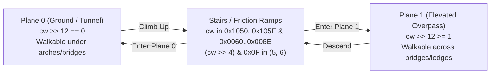

# Secret of Evermore Map Collision Mechanics

This document provides a comprehensive technical breakdown of how collision, passability, slopes, and environmental physics work across all maps in Secret of Evermore, based on empirical reverse-engineering of the ROM data structures and the map rendering engine.

---

## 1. Storage Architecture: The Block 3 Planar Slice

Unlike games that store collision in separate vector lists or secondary physics geometry files, Secret of Evermore tightly couples collision data to the visual **16×16 metatile layout**.

During map loading, Payload Block 3 is decompressed into 3 planar slices of equal size ($W \times H$ words):
- **Slice 0 ($W \times H$ words):** Layer 1 foreground/canopy tilemap words.
- **Slice 1 ($W \times H$ words):** Layer 2 background/terrain tilemap words.
- **Slice 2 ($W \times H$ words):** **Collision & Terrain Attribute Words.**

Every 16×16 pixel metatile on the map has exactly one 16-bit collision word defining how entities interact with that specific tile.

### Does it work the same on all maps?
**Yes.** The map engine uses a universal structure. The Block 3 decompression routine (`$909180..$909245`) processes the Slice 2 collision word identically for all 127 vanilla rooms in the game. Whether you are in Podunk, the Prehistoric Jungle, the Dark Forest, or Omnitopia, the collision logic parses this 16-bit structure uniformly.

---

## 2. Anatomy of the 16-Bit Collision Word

Every 16-bit collision word conforms to a 3-part layout:

$$\text{Collision Word} = \underbrace{\text{Zone / Elevation Plane}}_{\text{Bits 15..12}} \;\; \underbrace{\text{Environmental & Active Flags}}_{\text{Bits 11..4}} \;\; \underbrace{\text{Passability & Boundary Geometry}}_{\text{Bits 3..0}}$$

```text
  15  14  13  12  11  10   9   8   7   6   5   4   3   2   1   0  (Bit indices)
+---+---+---+---+---+---+---+---+---+---+---+---+---+---+---+---+
|  Zone / Plane |   Environmental / Physics   |   Boundary /   |
|   (Elevation) |    (Drift, Water, Stairs)   |     Geometry   |
+---+---+---+---+---+---+---+---+---+---+---+---+---+---+---+---+
```

| Bitfield | Bits | Function | Key Empirical Behaviors |
|---|---|---|---|
| **Boundary Geometry** | `0..3` | **Physical Passability & Slope Geometry** | • `0x0`: Unobstructed walkable floor.<br>• `0xF`: Fully solid impassable wall block.<br>• `0x1`, `0x2`, `0x5`, `0x6`, `0x9`, `0xA`, `0xD`, `0xE`: Sub-tile 45° diagonal slopes.<br>• `0x3`, `0x4`, `0x7`, `0x8`, `0xB`, `0xC`: Half-tile directional barriers (stump edges, counters). |
| **Environmental Physics** | `4..11` | **Physics Modifiers & Hazard Triggers** | • **Active Flag:** `0x01` (`bit 4 == 1`) flags standard interactive terrain.<br>• **Drift / Conveyor:** Sand drifts in the desert (`0x1B`) and volcano slides (`0x3B`).<br>• **Pipes:** Forced conduit travel through solid rock (`0x3D`).<br>• **Friction & Stairs:** Alters entity velocity and triggers elevation transitions. |
| **Zone / Elevation** | `12..15` | **Elevation Plane & Metatile Group** | • Governs multi-tier pathing (e.g. walking under vs. over bridges).<br>• Matches visual metatile families and room zones. |

---

## 3. Directional Walls & Diagonal Slopes

### Do walls have a direction?
**Yes, walls are explicitly directional.**

A common misconception is that a metatile is simply a binary "solid" or "walkable" 16×16 square. In reality, the lowest 4 bits govern edge passability and internal barriers:
- **`0x...F` (`1111`):** All edges and internal sub-pixels are solid (completely impassable block).
- **`0x...0` (`0000`):** All edges are open (freely walkable ground).
- **`0x...3`, `0x...4`:** Top barrier (blocking lower boundary, py $\ge$ 8).
- **`0x...C`, `0x...B`:** Bottom barrier (blocking upper boundary, py $<$ 8).
- **`0x...7`:** East barrier (blocking left boundary, px $<$ 8).
- **`0x...8`:** West barrier (blocking right boundary, px $\ge$ 8).

This architecture allows thin barriers (such as the central tree stump table in Strong Heart's hut or counters in shops) to occupy only part of a metatile while leaving the remainder passable.

### Are there diagonal collision detections?
**Yes! Diagonal slopes are a core mechanic of the engine.**

The engine explicitly recognizes 45° diagonal slopes within 16×16 metatiles:
- **Southwest (SW) Slope (`0x02`, `0x06`):** Solid where `py >= px`. The upper-right triangle is open ground; the lower-left triangle is solid wall.
- **Southeast (SE) Slope (`0x01`, `0x05`):** Solid where `px + py >= 15`. The upper-left triangle is open ground; the lower-right triangle is solid wall.
- **Northwest (NW) Slope (`0x0A`, `0x0E`):** Solid where `px + py <= 15`. The lower-right triangle is open ground; the upper-left triangle is solid wall.
- **Northeast (NE) Slope (`0x09`, `0x0D`):** Solid where `py <= px`. The lower-left triangle is open ground; the upper-right triangle is solid wall.

When the Boy or Dog walks into one of these diagonal boundaries, their movement vector is deflected along the 45° angle. This enables circular buildings (like Strong Heart's hut), winding cave tunnels, and mountain ledges to feel naturally rounded rather than jagged step-stools.

---

## 4. Environmental Physics: Drift, Pipes, and Stair Friction

Beyond simple blocking walls, the collision word encodes specialized terrain physics:

### 4.1 Quicksand & Sand Conveyor Drift (Desert of Doom, Room 0x1B)
Words such as `0x301D`, `0x301E`, `0x701D`, `0x701E`, `0x201E`, and `0x5010` in the desert do not block movement (`solid = 0`). Instead, they apply a constant directional drift vector every frame, sliding the player across the sand even when standing still.

### 4.2 Volcano Slides & Slopes (Room 0x3B)
Words such as `0x2024`, `0x3014`, and `0x3024` on volcano ramps represent steep gravel slides. They are fully walkable from a collision standpoint, but impart high downward velocity that forces the player downward unless continuously running against the slope.

### 4.3 Omnitopia Sewer Pipes (Room 0x3D)
In Room `0x3D`, collision words with high bytes `0x20`, `0x24`, `0x28`, `0x38`, `0x60`, `0x64`, and `0x68` occur directly over visual pipe graphics embedded within impassable rock (`low == 0x0F` or `0x00`). These tiles are traversable conduits: the player enters the pipe and is subjected to forced vertical/horizontal drift until exiting into a room chamber.

### 4.4 Stair Friction & Elevation Transitions
Stair tiles apply friction to slow down player horizontal and vertical speed while transitioning the entity's active elevation plane index (tracked in WRAM). They are not blocking walls.

### 4.5 Why `0x4010` is NOT a Doorway Opcode
In early community notes, `0x4010` was sometimes misclassified as a "Doorway / Exit" tile. Empirical inspection across all rooms reveals that `0x4010` has low nibble `0x00` (walkable floor) and upper nibble `0x4` (zone/family 4). 

Doorway warp transitions in Secret of Evermore are **never triggered by the collision word itself**; they are triggered exclusively by **Step-on Trigger records** (`trig_type == 0x0B`). The collision layer merely provides open walkable floor under the doorway so the player can physically step onto the trigger coordinates.

---

## 5. Case Study: Room 0x34 (Strong Heart's Hut)

Room `0x34` is an $18 \times 18$ metatile ($288 \times 288$ px) circular straw hut. It demonstrates how directional edges, diagonal slopes, and outer void padding interact.

### 5.1 Why Did the Numbers Initially Appear Scattered?

When collision data was first dumped and colored using raw unique 16-bit word IDs:
1. **Raw Word Splitting:** Words like `0x0010` (lower floor) and `0x1010` (upper floor) have identical physical properties (`low == 0`, open floor), but received contrasting arbitrary colors. This made the floor look artificially fragmented into two halves.
2. **Rectangular VRAM Padding:** SNES VRAM tilemaps are always rectangular ($18 \times 18$). The circular hut occupies only the interior. The level designers filled the outer void (columns 0 and 17) with metatile `0x00` from the palette, which inherited collision words `0x0010` and `0x1010`. In raw visualization, these outer black void tiles appeared as "walkable floor," obscuring the true circular perimeter.

### 5.2 The True Passability Grid

Evaluating the low-nibble geometry (`cw & 0x0F`) reveals the true circular architecture:

```text
     00 01 02 03 04 05 06 07 08 09 10 11 12 13 14 15 16 17 (Columns)
R00: ..  F  F  F  F  F  F  F  F  F  F  F  F  F  F  F  F ..  (Top wall perimeter)
R01: ..  F  F  F  F  F  F  F  F  F  F  F  F  F  F  F  F ..
R02: ..  F  F  F  F  F  F  F  F  F  F  F  F  F  F  F  F ..
R03: ..  F  F  F  F  F  F  F  F  F  F  F  F  F  F  F  F ..
R04: ..  F  F  F  F  F  F  F  F  F  F  F  F  F  F  F  F ..
R05: ..  F  F  F  F  F  F  F  F  F  F  F  F  F  F  F  F ..
R06: ..  F  F  F  F  9  A  .  .  .  .  9  A  F  F  F  F ..  (Strong Heart's counter)
R07: ..  F  F  E  .  .  .  .  .  .  .  .  5  F  F  F  F ..  (Gourd B-triggers)
R08: ..  F  F  .  .  .  .  .  .  .  .  .  9  A  D  F  F ..
R09: ..  F  E  .  .  .  .  .  .  .  .  .  .  F  F  F  F ..
R10: ..  F  .  .  .  .  3  3  3  3  .  .  .  9  A  D  F ..  (Top of tree stump table)
R11: ..  F  .  .  .  8  F  F  F  F  7  .  .  .  .  .  F ..  (Solid tree stump core)
R12: ..  F  .  .  .  8  F  F  F  F  7  .  .  .  .  .  F ..
R13: ..  F  .  .  .  .  .  .  .  .  .  .  .  .  .  .  F ..  (Main walking floor)
R14: ..  F  2  .  .  .  .  .  .  .  .  .  .  .  .  1  F ..  (45° diagonal slopes)
R15: ..  F  F  2  .  .  .  .  .  .  .  .  .  .  1  F  F ..
R16: ..  F  F  F  2  .  .  .  .  .  .  .  .  1  F  F  F ..
R17: ..  F  F  F  F  F  F  F  .  .  F  F  F  F  F  F  F ..  (Walkable exit doorway)
```

- **Outer Ring (`F`):** Impassable solid wall containment ring.
- **Diagonal Slopes (`1` and `2`):** Rows 14–16 curve smoothly inward toward the doorway using 45° slopes (`1` = SE slope, `2` = SW slope).
- **Central Stump Table (Rows 10–12):** Solid core (`F`) surrounded by half-tile barriers: top edge (`3`), west edge (`8`), east edge (`7`).
- **Doorway Threshold (Row 17, Cols 8–9):** Open walkable floor (`4010`, `low == 0`), directly aligned with the step-on exit trigger.

---

## 6. Visualization Tooling (`tools/render_map.py`)

### 6.1 Default Mode: Crisp Red Contour Line (`--collision-mode contour`)

By default, generating the collision layer (`--layer collision` or `--collision`) produces an intuitive overlay:
- **Red Boundary Line (`#EB1919`, 2px thick, zero gaps):** Traces the exact boundary between walkable and non-walkable space, following 45° diagonal slopes where present.
- **Light Red Tint ($\alpha = 0.30$):** Highlights non-walkable solid walls, obstacles, and outer void.
- **Untinted Walkable Floor:** Composite graphics show through with 100% clarity so room features, rugs, and triggers remain visible.

```bash
# Render default continuous red contour collision overlay on Room 0x34
python tools/render_map.py 0x34 --layer collision
```

### 6.2 Secondary Mode: Semantic ASCII Art (`--collision-mode ascii`)

Visualizes each metatile with its physical group color and centered 7×7 bitmap glyphs:
- `#` (Red): Solid Wall (`low == 0x0F`)
- `/` (Orange): Diagonal Slope SW-to-NE (`low in (0x01, 0x05, 0x0A, 0x0E)`)
- `\` (Orange): Diagonal Slope NW-to-SE (`low in (0x02, 0x06, 0x09, 0x0D)`)
- `|` (Gold): Vertical Barrier (`low in (0x07, 0x08)`)
- `-` (Yellow): Horizontal Barrier (`low in (0x03, 0x04, 0x0B, 0x0C)`)
- Soft Green (no glyph): Walkable floor, pipes, slides, and drifts.

```bash
# Render physical groups with ASCII art glyphs
python tools/render_map.py 0x34 --layer collision --collision-mode ascii
```

### 6.3 Secondary Mode: Verbose Word Palette (`--collision-verbose`)

Assigns a unique pastel color to every distinct 16-bit word across the room and labels tiles with their sequential type indices (`0..N-1`) or 4-digit hex strings (`--collision-label hex`). Indispensable for romhackers inspecting elevation plane bits and metatile family assignments.

```bash
# Render unique pastel hue per 16-bit word + numeric indices
python tools/render_map.py 0x34 --layer collision --collision-verbose

# Render unique pastel hue per 16-bit word + 4-digit hex labels
python tools/render_map.py 0x34 --layer collision --collision-verbose --collision-label hex
```

---

## 7. Floor Awareness & Multi-Tier Elevation: Volcano 0x3B

In *Secret of Evermore*, complex multi-tier maps (such as Volcano Room `0x3B`, Halls NW `0x24`, and Bugmuck Exterior `0x67`) allow the player to walk **under bridges and overpasses through seamless tunnels**, then climb stairs to walk **across the upper bridge structure**:



1. **Plane 0 (Ground / Underpass / Tunnels):** Walkable metatiles with `(cw >> 12) == 0`. In Room `0x3B`, the player navigates the volcanic cave floor under rock overhangs and arches.
2. **Plane 1 (Elevated Paths / Bridges):** Walkable metatiles with `(cw >> 12) >= 1`. In Room `0x3B`, upper catwalks and bridges cross overhead without blocking the player below.
3. **Transition Stairs (`0x105x` $\leftrightarrow$ `0x006x`):** Pairs of transition ramps connect the two planes. Mid-nibble `0x5` and `0x6` slow the player's movement and swap the active WRAM elevation plane.

---

## 8. Unified Composition Layer (`--layer composition`)

The unified composition renderer synthesizes all environmental physics, collision contours, multi-tier elevation, dynamic Section 3 object stamps, and weapon-gated triggers onto a single, cohesive graphic:

| Element | Color / Visual Glyph | Description |
|---|---|---|
| **Passability Contour** | 🔴 Crisp Red Line (`#EB1919`, 2px thick) | Continuous boundary separating walkable terrain from walls/void. |
| **Impassable Solid** | 🔴 Soft Red Tint (`#EB1919`, $\alpha \approx 0.22$) | Walls, rocks, chasms, and outer black padding. |
| **Plane 1 (Elevated)** | 🟣 Soft Purple Tint (`#9C27B0`, $\alpha \approx 0.20$) | Elevated walkways, bridges, and high ledges (distinct from ground tunnels). |
| **Plane 0 (Ground / Tunnels)** | Untinted Composite Graphics | Natural ground paths and underpass tunnels show with 100% clarity. |
| **Stairs & Friction** | 🟠 Amber Tint (`#FFA000`, $\alpha \approx 0.40$) + Step Rungs | Ramps and stairs that transition elevation and apply speed friction. |
| **Drift & Conveyors** | 🔵 Bright Cyan Tint (`#00BCD4`, $\alpha \approx 0.40$) + Flow Chevrons | Volcano steep slides (`v`), trash conduit pipes, and quicksand currents (`<`, `>`). |
| **Cuttable Barriers** | 🟢 Vibrant Lime Green (`#4CAF50`, $\alpha \approx 0.50$) + Crosshatch | Obstacles destroyed by weapons (Axe, Spear, Knight Basher checks). |
| **Dynamic Object Stamps** | 🟦 Soft Blue Tint (`#2196F3`, $\alpha \approx 0.35$) + 1px Blue Border | Metatiles modified by Section 3 objects (bridges, gourds, pressure plates). |
| **B-Triggers** | 🟨 Yellow Box (`#FFFF00`, matching `soestuff.lua`) | Interactive inspect/sniff/combat triggers. |
| **Step-on Triggers** | 🟪 Pink Box (`#FF00FF`, matching `soestuff.lua`) | Room warps, doorway thresholds, and conveyor loops. |
| **Legend Banner** | Dark Bottom Panel (36px high) | Automatic color key footer explaining all features. |

---

## 9. Dynamic Section 3 Object Stamping Descriptors ($W \times H$)

Dynamic map objects (gourds, sewer gates, bridges, cuttable bushes, cave entrances) modify metatiles in VRAM at runtime via the SNES engine stamping routine `$90A5D0..$90A640`.

### 9.1 Descriptor Binary Structure
The room's Section 3 payload stores an offset table at `aa_off`. For each object record:
- **Byte 0:** `num_states`
- **Followed by 5-byte state descriptors:** `[flag, origin_x, origin_y, target_offset_lo, target_offset_hi]`
- **At `target_ptr = aa_off + target_offset`:**
  - **Byte 0:** `target_width` ($W$)
  - **Byte 1:** `target_height` ($H$)
  - **Bytes 2..2 + 2*(W*H):** Array of 16-bit metatile IDs stamped into VRAM across the $W \times H$ rectangle.

```text
Section 3 Base: aa_off
  │
  ├── Record Pointer (aa_off + obj_offset)
  │     ├── [0]: num_states
  │     └── [1..5]: State 0 [flag, origin_x, origin_y, target_off_lo, target_off_hi]
  │                                                      │
  └── Stamping Block (target_ptr = aa_off + target_offset)
        ├── [0]: target_width  (W)  e.g., 2 (gourd), 3 (sewer gate)
        ├── [1]: target_height (H)  e.g., 2 (gourd), 4 (sewer gate)
        └── [2..]: W * H 16-bit Metatile IDs
```

### 9.2 True Bounding Dimensions
- **Gourds / Pots (Room `0x34`, `0x38`):** $2 \times 2$ metatiles ($32 \times 32$ px).
- **Sewer Drain Gates (Room `0x12`):** $3 \times 4$ metatiles ($48 \times 64$ px), perfectly framing the $3 \times 4$ doorway trigger.
- **Cliff Entrances (Room `0x69`):** $3 \times 3$ metatiles ($48 \times 48$ px).

### 9.3 Cuttable Grass & Bush Patches vs. Wall Collision
In Prehistorica (`0x69`, `0x38`, `0x5C`), bush obstacles blocking paths are dynamic engine objects. Initially, their collision words carry solid geometry (`0x0F` or `0x901F`) to prevent passage.
When struck with a slashing weapon (Bone Axe, Knight Basher):
1. The engine executes a weapon-check script (`$2360` / `$235F`).
2. The object transitions from State 0 (impassable bush) to State 1 (chopped stump).
3. The collision word is cleared to open ground (`0x00`).

Because these obstacles are destructible, the unified composition visualizes them in **vibrant green (`#4CAF50`) with diagonal crosshatching**, and **excludes them from the permanent red wall contour line**. This prevents false cliff edges from confusing navigation maps.

---

## 10. Pipe Conduit Vector Routing (Sewers 0x3D)

In Room `0x3D`, fluid drift conveyors transport the player along longitudinal sewer pipes. Rather than pointing perpendicularly against pipe walls, flow vectors run along the pipe conduits:
- Inlets are marked by step-on triggers (`0x0B`).
- Fluid velocity vectors follow the pipe corridors seamlessly toward drain reservoirs, turning at corners (`>`, `v`, `<`, `^`).
- Ramps and volcano slides (`0x3B`) are strictly distinguished from drift conveyors: slides apply elevation transitions and friction (amber rungs), while conduits apply forced momentum (cyan chevrons).

