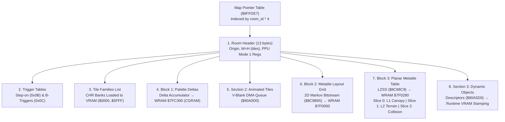

# Secret of Evermore Map Editor Architecture & ROM Limitations

This document synthesizes our empirical reverse-engineering of the *Secret of Evermore* map pipeline into an architectural specification for a **custom map editor and injector**. It addresses technical feasibility, hardware constraints, ROM limits, and in-place patching workflows.

---

## 1. Map Data Architecture Overview

A Secret of Evermore map is not a single flat bitmap; it is a **multi-stage, multi-tier composite** structured into three primary data layers:



---

## 2. Tiles and Palette Limitations: Can We Mix Water and Lava?

### 2.1 The SNES Mode 1 Hardware Budget
*Secret of Evermore* runs in standard **SNES Mode 1** (Layer 1: 16-color 4bpp, Layer 2: 16-color 4bpp, Layer 3: 4-color 2bpp status bar):
- **CGRAM (Color RAM):** 8 background palettes (Palettes 0..7). Each palette has 16 colors (Color 0 = transparent, Colors 1..15 = opaque), giving **120 unique simultaneous background colors**.
- **Shared Palettes:** Layer 1 (foreground/canopy) and Layer 2 (terrain) share these same 8 palettes.
- **VRAM CHR Storage:** 64 KB total VRAM ($0000..$7FFF words).
  - BG1 Tilemap: 2 KB – 4 KB
  - BG2 Tilemap: 2 KB – 4 KB
  - CHR Character Tiles (8×8 4bpp pixels): Remaining ~56 KB (~1,792 unique 8×8 tiles).

### 2.2 Tile Families
Every room header defines a list of up to 7–8 **Tile Family IDs** (e.g. `0x0020`, `0x0091`, `0x00C4`). Each tile family represents a compressed graphics bank containing specific 8×8 character patterns and 16×16 metatile building blocks.
- **Limitation:** You cannot load arbitrary individual tiles from across the entire game into one room. You must assemble the map from the tile families currently loaded into VRAM.

### 2.3 Can We Mix Water and Lava in the Same Map?
**Yes, but subject to two strict constraints: CGRAM Palettes and Animated DMA Slots.**

1. **Palette Budget (Pass):**
   - Water tiles require cool blue/cyan tones (typically assigned to Palette 2 or 3).
   - Lava tiles require warm red/orange/yellow tones (typically assigned to Palette 4 or 5).
   - If the room's remaining palette slots accommodate the base terrain (e.g., 2 palettes for rock/cave) while leaving 1 palette for water and 1 for lava, the SNES PPU can render both simultaneously without conflict.

2. **Animated Tile DMA Budget (The Real Bottleneck):**
   - Both water ripples and flowing lava in Evermore are **not static tiles**; they are **Animated CHR Tiles** registered in Section 2.
   - During V-Blank, the engine runs a DMA transfer queue (`$90A0D0..$90A1A0`) that updates animated CHR character patterns in VRAM every few frames.
   - **V-Blank Bandwidth Limit:** The SNES V-Blank interval can only transfer ~6 KB per frame. The Evermore engine allocates safe bandwidth for **4 to 8 animated tiles per room**.
   - If water and lava are both animated at the same time, their animation frames will compete for Section 2 slots. If exceeded, the engine drops frames, causes sprite tearing, or crashes the DMA transfer.
   - *Workaround:* Render one fluid as static/semi-static (or budget 2 frames of water + 2 frames of lava) to stay within the 8-tile DMA limit.

---

## 3. Dynamic Objects: How Many Are Supported?

Dynamic objects (Section 3) are used for gourds, chests, cuttable grass, sewer gates, bridges, and pressure plates.

| Boundary Layer | ROM / Engine Constraint | Practical Limit |
|---|---|---|
| **Header Counter** | Byte at `obj_sec_off` | Max **255 objects** mathematically (`$00..$FF`). |
| **Pointer Table** | Word array at `fa2 + i * 2` | 2 bytes per object. 255 objects would take 510 bytes. |
| **Section 3 Buffer** | Variable payload between Block 3 and room end | Rooms allocate ~256 to 768 bytes for Section 3. |
| **WRAM Object State Array** | Stamping state table in WRAM | Vanilla rooms never exceed **30–45 objects**. |

### Practical Limit for Custom Maps
- Rooms with simple objects (e.g. 1×1 grass patches, gourds): **up to 40 objects** safely.
- Complex multi-state objects (e.g. collapsing bridges, 4-state gates): **15–25 objects**.
- Exceeding ~45 objects risks overflowing the allocated Section 3 sub-block in ROM or exceeding the WRAM object state buffer.

---

## 4. Map Size Constraints: How Big Can Maps Be?

A common misconception is that a map's dimensions determine its decompressed footprint directly. In Evermore, maps use a **Two-Level Indirection Architecture**:

```
Level 1: The Grid (Block 2)          Level 2: The Dictionary (Block 3)
W × H Array of Metatile Indices       Table of Unique Metatile Definitions
(e.g., 106 × 125 = 13,250 cells)     (e.g., 575 unique metatiles × 6 bytes)
```

### 4.1 Header Limits
- Header byte 2 = `width_tiles` (1 byte, `0..255`).
- Header byte 3 = `height_tiles` (1 byte, `0..255`).
- **Theoretical Maximum Dimensions:** $255 \times 255$ metatiles ($4,080 \times 4,080$ pixels).

### 4.2 WRAM Buffer Constraints (Bank $7F)
When a room loads, the engine decompresses:
1. **Block 3 (The Metatile Dictionary):**
   - Decompressed size = $\text{metatile\_count} \times 6$ bytes (2 bytes L1 + 2 bytes L2 + 2 bytes Collision).
   - In vanilla, `metatile_count` is typically 300 to 700 tiles (**1.8 KB to 4.2 KB**).
   - Destination: WRAM `$7F0280`.
2. **Block 2 (The Layout Grid):**
   - Decompressed size = $W \times H \times 2$ bytes.
   - For Room `0x4B` (the largest vanilla map, $106 \times 125$): $13,250 \times 2 = \mathbf{26.5\text{ KB}}$.
   - Destination: WRAM `$7F0000` / dynamic heap.

### 4.3 What is the Practical Maximum Map Size?
- WRAM Bank `$7F` has 64 KB ($7F0000..$7FFFFF).
- Reserving space for the Block 3 metatile table (~4 KB) and engine scratch buffers leaves **~32 KB to 40 KB for the grid**.
- At 2 bytes per cell, this permits maps of up to **16,000 to 20,000 metatiles**.
- Examples: **$128 \times 128$**, **$160 \times 100$**, or **$200 \times 80$**.
- Room `0x4B` ($106 \times 125 = 13,250$ metatiles) already pushes the vanilla engine close to its comfortable ceiling.

---

## 5. In-Place Patching of Single Tiles vs. Recompression

### Can we patch single tiles in an existing map without recompressing?
**In the raw ROM stream: NO. But at the Engine/Pipeline level: YES, via three distinct methods.**

```
                      Single-Tile Modification Methods
                                    │
       ┌────────────────────────────┼────────────────────────────┐
       ▼                            ▼                            ▼
Method 1: Section 3 Stamping  Method 2: WRAM Script Writes  Method 3: Pipeline Repointing
Zero-compression override     Runtime poke to $7F0280       Decompress → Edit → Repoint
```

#### Why Raw ROM Stream In-Place Patching Fails
- Block 2 uses **2D Markov Bitstream compression** (`$8C9B65`).
- Block 3 uses **LZSS sliding-window compression** (`$8C98C9`).
- Both are variable-bit-length streaming algorithms. Flipping a single bit or changing one byte mid-stream invalidates all downstream bit-shifts, breaks sliding window back-references, and corrupts every subsequent tile on the map.

#### How to Achieve Single-Tile Edits Cleanly:

1. **Method 1: Section 3 Dynamic Object Stamping (Zero Compression)**
   - *How vanilla does it:* Invisible bridges (Revealer spell), opened doors, cut bushes, and dynamic staircases do not modify the base tilemap; they use a Section 3 object record.
   - An object with $1 \times 1$ footprint can stamp ANY metatile word over any background coordinate on room load (`State 0`).
   - *Pros:* Zero recompression needed. Can be added as a patch record.

2. **Method 2: Script VM / WRAM Overwrite at Runtime**
   - The map layout is fully decompressed into WRAM on room entry.
   - An Everscript enter script can write directly to WRAM:
     ```csharp
     // Overwrite tile in WRAM grid after decompression
     <0x7F0000 + (y * width + x) * 2> = 0x0123;
     ```
   - *Pros:* Instant, programmatic control; can change tiles dynamically based on story flags.

3. **Method 3: Build Pipeline Decompress-Edit-Repoint (Recommended for Editors)**
   - Because Python decompresses and recompresses room blobs in under **20 milliseconds**:
     1. Decompress room blob using `tools/dump_room.py`.
     2. Edit the single target metatile or collision word in the array.
     3. Recompress the blob (using LZSS or uncompressed fallback).
     4. Append the new blob to free ROM space (e.g. Bank `$40+`).
     5. Update the 4-byte table entry at `$9FFDE7 + room_id * 4`.
   - *Pros:* Completely clean; modifies the actual base map without wasting object slots or script execution time.

---

## 6. What Information / Components Are Missing for a Full Editor?

Our research has reverse-engineered **~85% of the map format**. To build a standalone, interactive map editor, the following components are complete vs. remaining:

| Component | Status | Implementation Details |
|---|---|---|
| **Header Decoding** | ✅ **Complete** | 13-byte header, origin coordinates, PPU Mode 1 registers, effect variants. |
| **Map Pointer Table** | ✅ **Complete** | 24-bit pointer resolution from `$9FFDE7`. |
| **Step-on & B-Triggers** | ✅ **Complete** | 6-byte records decoded, visualized, and mapped to script IDs. |
| **Tile Families & CHR** | ✅ **Complete** | Tile family extraction, CHR decompression, 8×8 tile assembly. |
| **CGRAM Palettes** | ✅ **Complete** | Block 1 delta accumulator (`$7FC300`), 15-bit BGR555 color decoding. |
| **Block 3 Planar Slices** | ✅ **Complete** | LZSS decompression to Layer 1, Layer 2, and Collision attributes. |
| **Section 3 Dynamic Objects** | ✅ **Complete** | State descriptors, target dimensions ($W \times H$), metatile arrays. |
| **Section 2 Animated Tiles** | ✅ **Complete** | Animated tile IDs decoded; timing scripts documented. |
| **Markov 2D Decompressor** | ✅ **Complete** | Exact bitstream reader (`$8C9B65`) in `tools/dump_room.py`. |
| **Markov 2D Compressor** | ⚠️ **Missing** | We can read Markov bitstreams, but lack the matching encoder.<br>*(Bypass: Engine dispatcher `$8C988D` supports uncompressed `0x00` and LZSS `0x03`).* |
| **Metatile Assembler UI** | 🔨 **Needs Tooling** | A GUI brush tool to compose 16×16 metatiles from 8×8 CHR character tiles. |
| **Entity Spawn Linking** | ℹ️ **Design Note** | Enemies/NPCs are not in map headers; they are spawned by **Everscript Enter Scripts** (`add_enemy(...)`). An editor must link with `.evs` source files. |

---

## 7. Is the Total Number of Maps Limited?

### 7.1 Vanilla Limit: 128 Rooms (`0x00..0x7F`)
- The vanilla ROM defines **128 rooms**.
- The Map Pointer Table starts at `$9FFDE7` (`0x1FFDE7` in ROM file).
- The table is located near the end of Bank `$9F` (`$9F8000..$9FFFFF`), which terminates at `0x1FFFFF`.
- Space remaining in Bank `$9F`:
  $$0x1FFFFF - 0x1FFDE7 = 536\text{ bytes} \implies \frac{536}{4} = \mathbf{134\text{ entries}}$$
- Without relocation, you can only add **6 additional rooms** (`0x80..0x85`) before overflowing Bank `$9F`.

### 7.2 Expanding Beyond 128 Rooms
Can the map table be expanded? **Yes, up to 256 rooms easily.**

1. **Engine Room Loading Hook (`$908F6A`):**
   ```assembly
   LDA $0ADB     ; Load Room ID (1 byte)
   ASL
   ASL           ; Room ID * 4
   TAX
   LDA $9FFDE7,X ; Read 24-bit pointer
   ```
   The engine does **not perform a bounds check** on `room_id`. It simply multiplies by 4 and indexes `$9FFDE7`.
2. **Relocating the Table via Asar Patch:**
   Move the pointer table to free ROM space (e.g., Bank `$40` or `$50`) and update the instruction:
   ```assembly
   org $908F6E
       LDA !NEW_MAP_TABLE,X
   ```
3. **Upper Limit:**
   Because `room_id` in WRAM (`$0ADB`) and in the `CHANGE MAP` bytecode instruction (`0x22 <room_id> <x> <y>`) is an 8-bit byte, the engine natively supports up to **256 maps (`0x00..0xFF`)** without altering bytecode structures.

---

## 8. Summary Checklist for Building a Map Editor

1. **Viewer / Export Pipeline:** Already functional via `tools/dump_room.py` and `tools/render_map.py` (composite PNG, collision contour, trigger overlays, full multi-layer composition).
2. **Editing Workflow:**
   - Modify the decompressed $W \times H$ metatile array and collision matrix.
   - Compress Block 3 with LZSS (`LZSSCompressor`).
   - Pack Block 2 using LZSS (`sub_flag 0x03`) or raw copy (`sub_flag 0x00`) to bypass Markov compression.
3. **Injection Workflow:**
   - Append new room blob to free ROM space.
   - Update 4-byte pointer entry in table `$9FFDE7`.
   - Update room enter script in Everscript to handle entity spawns.
