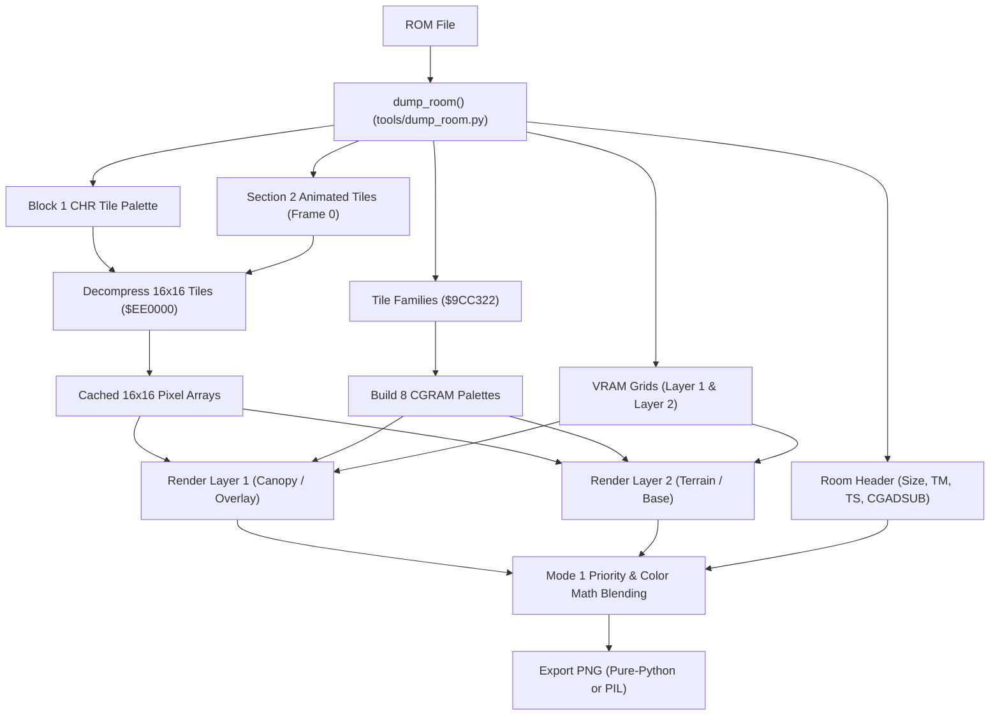

# Secret of Evermore Map Graphics PNG Rendering Pipeline

> [!IMPORTANT]
> **Empirical SNES PPU Mode 1 Pipeline**  
> All rendering logic is derived from SNES PPU hardware specifications and 65c816 disassembly of the Secret of Evermore engine, validated against `Secret of Evermore (U) [!]`.
> Core implementation resides in [`tools/render_map.py`](../tools/render_map.py) with payload decoding in [`tools/dump_room.py`](../tools/dump_room.py).

---

## 1. Pipeline Architecture Overview

The map rendering pipeline transforms raw ROM room blobs into pixel-accurate multi-layer PNG images:



---

## 2. Layers & Hardware Mapping

Secret of Evermore runs in SNES **Mode 1** (16-color 4bpp for BG1 and BG2):

| Layer | SNES BG | Description | Alpha / Blend Behavior |
|---|---|---|---|
| **Layer 1** | BG1 | Canopy, treetops, foreground architecture, overhangs, reflections. | Transparent RGBA (empty pixels have $\alpha = 0$). |
| **Layer 2** | BG2 | Terrain base, walkable ground, walls, waterbeds, backgrounds. | Transparent RGBA (empty pixels have $\alpha = 0$). |
| **Composite** | Mode 1 | Full composite image with Mode 1 priority sorting, color math, and canvas backdrop. | Solid RGBA (or transparent if `--bg-color transparent`). |
| **Collision** | Overlay | Visual grid of terrain passability attributes color-coded by collision word. | Semi-transparent grid overlaid on composite. |
| **Triggers** | Overlay | Visual bounding boxes for Step-on (Green) and B-Trigger (Orange) interactive zones. | Outlined boxes overlaid on composite. |

---

## 3. SNES Mode 1 Priority Rules

Each 16-bit SNES VRAM tilemap word encodes:
- **Bits 0..9**: Character index $k$ (maps to tile palette).
- **Bits 10..12**: Palette index (0..7).
- **Bit 13 (`0x2000`)**: **Priority bit ($P$)**.
- **Bit 14 (`0x4000`)**: Horizontal flip.
- **Bit 15 (`0x8000`)**: Vertical flip.

In SNES Mode 1, pixel composition follows strict hardware priority:

$$\text{BG1 Pri 1} > \text{BG2 Pri 1} > \text{BG1 Pri 0} > \text{BG2 Pri 0} > \text{Backdrop}$$

### Implementation
```python
if p1 and a1 > 0:
    # BG1 Priority 1 always wins over everything below it
    pixel = color1
elif p2 and a2 > 0:
    # BG2 Priority 1 wins over BG1 Priority 0
    pixel = color2
elif a1 > 0:
    # BG1 Priority 0 (supports color math if enabled)
    pixel = color_math(color1, color2) if bg1_math else color1
elif a2 > 0:
    # BG2 Priority 0
    pixel = color2
else:
    # Canvas backdrop color
    pixel = backdrop_color
```

---

## 4. Color Math (`CGADSUB`) & Reflections (Room `0x4D`)

In Room `0x4D` (*Palace Interior*), arches and pillars appear in the upper half of the room, while a semi-transparent reflection appears across the polished marble floor in the lower half:

- **Top Half**: Upright arches and throne are drawn on Layer 2 with priority bit set (**BG2 Pri 1**).
- **Bottom Half**: Inverted reflection is drawn on Layer 1 (**BG1 Pri 1**) above the solid orange marble floor on Layer 2 (**BG2 Pri 0**).
- **Color Math Register**: `CGADSUB = 0x41` specifies:
  - Bit 6 (`0x40`): Half-addition color math (`div2 = True`).
  - Bit 0 (`0x01`): Color math enabled for BG1.
- **Subscreen Register**: `TS = 0x12` designates BG2 on the subscreen as the blending source.

The blended color is calculated via hardware half-addition:

$$C_{\text{final}} = \left\lfloor \frac{C_{\text{BG1}} + C_{\text{BG2}}}{2} \right\rfloor$$

This produces the authentic translucent marble floor reflection matching original game output.

---

## 5. Main Screen vs. Subscreen Visibility (Room `0x4B`)

In Room `0x4B` (*Oglin Cave*), the room header designates:
- `display_tm = 0x16` (`0001 0110b`) $\to$ BG2, OBJ, and Color Window enabled on Main Screen; **BG1 is disabled** (`bit 0 == 0`).
- `subscreen_ts = 0x01` (`0000 0001b`) $\to$ BG1 enabled on Subscreen.

BG1 in Room `0x4B` is an ambient darkness vignette mask dynamically centered on the player at runtime. By respecting `display_tm & 0x01`, the static circular mask at $(0, 0)$ is omitted from the main map composite, leaving the cave cleanly visible.

---

## 6. Section 2 Dynamic Animated Tiles

Immediately following Block 1's payload sits **Section 2**, containing animation channel streams for dynamic environmental graphics.
- The pipeline extracts Frame 0 of all Section 2 animation channels and appends them to the room tile palette.
- Restores 1,020 animated elements across 95 rooms (running water, lava bubbles, rotating fans, guard faces, torch flames, light beams, and stone wall mechanisms).

---

## 7. Backdrop Color Handling & Overrides

By default, map composites render with a **solid black background** `(0, 0, 0, 255)` so that non-drawn voids and rectangular borders outside room geometry appear clean.

The user can customize the backdrop color using `parse_color()`:

| Option | Syntax | RGBA Output | Description |
|---|---|---|---|
| **Default** | `"black"` | `(0, 0, 0, 255)` | Solid pitch black canvas. |
| **Transparent** | `"transparent"`, `"none"`, `"clear"` | `(0, 0, 0, 0)` | Transparent canvas for overlays. |
| **CGRAM** | `"cgram"`, `"rom"` | Hardware Color 0 | Reads CGRAM Color 0 at `$9CC322 + fam0 * 32`. |
| **Hex Color** | `"#1a2b3c"`, `"1a2b3c"`, `"#fff"` | `(R, G, B, 255)` | Standard 3-digit, 6-digit, or 8-digit hex. |
| **RGB Tuple** | `"255,0,0"`, `(255, 0, 0)` | `(R, G, B, 255)` | Comma-separated or Python tuple. |

---

## 8. CLI Reference

### 8.1 Standalone Map Renderer (`tools/render_map.py`)

```bash
# Render all layers (layer1, layer2, composite) with default black background
python tools/render_map.py 0x5c --out-dir out/maps

# Render specific layer (composite only)
python tools/render_map.py 0x4d --layer composite

# Render with transparent background
python tools/render_map.py 0x4d --layer composite --bg-color transparent

# Render with raw SNES CGRAM Color 0
python tools/render_map.py 0x4d --layer composite --bg-color cgram

# Render with collision overlay and triggers
python tools/render_map.py 0x5c --collision --triggers

# Batch render all 127 vanilla rooms
python tools/render_map.py --all-rooms --out-dir out/all_maps
```

### 8.2 Room Dumper PNG Flag (`tools/dump_room.py`)

```bash
# Dump room metadata and render PNG layers
python tools/dump_room.py 0x5c --png --png-dir out/maps

# Customize background color
python tools/dump_room.py 0x4d --png --bg-color black
```
