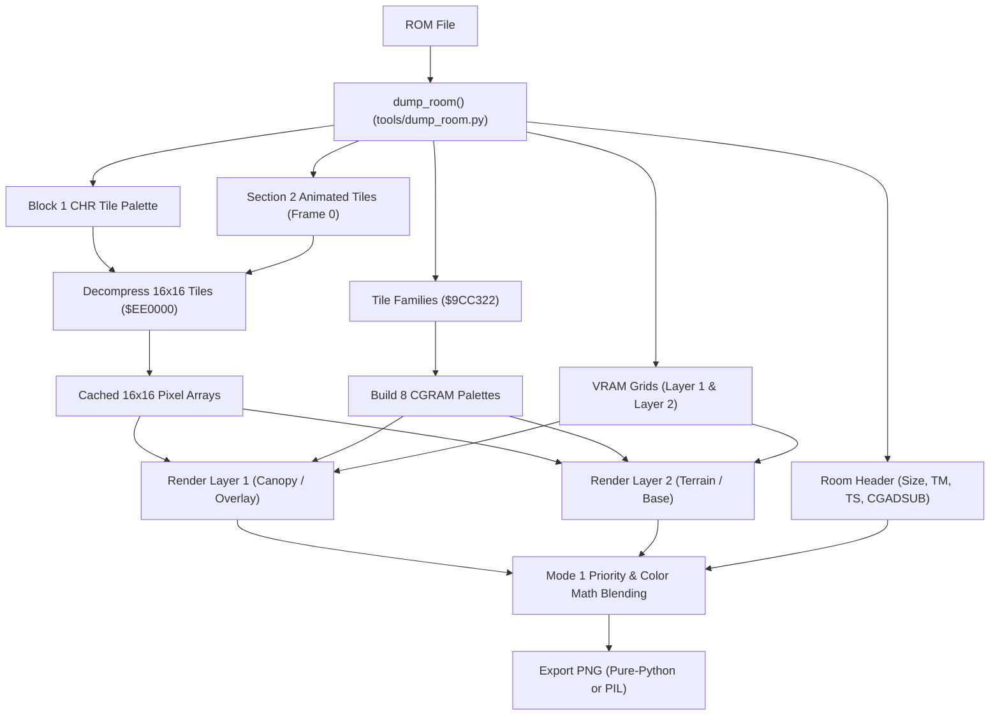

# Secret of Evermore Map Graphics PNG Rendering Pipeline

> [!IMPORTANT]
> **Empirical SNES PPU Mode 1 Pipeline**  
> All rendering logic is derived from SNES PPU hardware specifications and 65c816 disassembly of the Secret of Evermore engine, validated against `Secret of Evermore (U) [!]`.
> Core implementation resides in [`tools/render_map.py`](../tools/render_map.py) with payload decoding in [`tools/dump_room.py`](../tools/dump_room.py).

---

## 1. Pipeline Architecture Overview

The map rendering pipeline transforms raw ROM room blobs into pixel-accurate multi-layer PNG images:



---

## 2. Layers & Hardware Mapping

Secret of Evermore runs in SNES **Mode 1** (16-color 4bpp for BG1 and BG2):

| Layer | SNES BG | Description | Alpha / Blend Behavior |
|---|---|---|---|
| **Layer 1** | BG1 | Canopy, treetops, foreground architecture, overhangs, reflections. | Transparent RGBA (empty pixels have $\alpha = 0$). |
| **Layer 2** | BG2 | Terrain base, walkable ground, walls, waterbeds, backgrounds. | Transparent RGBA (empty pixels have $\alpha = 0$). |
| **Composite** | Mode 1 | Full composite image with Mode 1 priority sorting, color math, and canvas backdrop. | Solid RGBA (or transparent if `--bg-color transparent`). |
| **Grid** | Overlay | Subtle sub-tile (8px soft) and metatile (16px strong) alignment grid. | Alpha-blended grid lines overlaid on composite. |
| **Collision** | Overlay | Visual grid of terrain passability attributes color-coded by collision word. | Semi-transparent grid overlaid on composite. |
| **Triggers** | Overlay | Visual bounding boxes for Step-on (Pink #FF00FF) and B-Trigger (Yellow #FFFF00) zones (matching `soestuff.lua`). | Outlined semi-transparent boxes overlaid on composite. |

---

## 3. SNES Mode 1 Priority Rules

Each 16-bit SNES VRAM tilemap word encodes:
- **Bits 0..9**: Character index $k$ (maps to tile palette).
- **Bits 10..12**: Palette index (0..7).
- **Bit 13 (`0x2000`)**: **Priority bit ($P$)**.
- **Bit 14 (`0x4000`)**: Horizontal flip.
- **Bit 15 (`0x8000`)**: Vertical flip.

In SNES Mode 1, pixel composition follows strict hardware priority:

$$\text{BG1 Pri 1} > \text{BG2 Pri 1} > \text{BG1 Pri 0} > \text{BG2 Pri 0} > \text{Backdrop}$$

### Implementation
```python
# 1. Main Screen Layer Selection (Mode 1 priority: BG1 P1 > BG2 P1 > BG1 P0 > BG2 P0)
if bg1_main and p1 and a1 > 0:
    main_layer, main_color = 1, color1
elif bg2_main and p2 and a2 > 0:
    main_layer, main_color = 2, color2
elif bg1_main and (not p1) and a1 > 0:
    main_layer, main_color = 1, color1
elif bg2_main and (not p2) and a2 > 0:
    main_layer, main_color = 2, color2
else:
    return backdrop_color

# 2. Subscreen Layer Selection (from subscreen-enabled layers, excluding main_layer)
if bg1_sub and p1 and a1 > 0 and main_layer != 1:
    sub_color = color1
elif bg2_sub and p2 and a2 > 0 and main_layer != 2:
    sub_color = color2
elif bg1_sub and (not p1) and a1 > 0 and main_layer != 1:
    sub_color = color1
elif bg2_sub and (not p2) and a2 > 0 and main_layer != 2:
    sub_color = color2
else:
    sub_color = None

# 3. Hardware Color Math
math_enabled = (main_layer == 1 and bg1_math) or (main_layer == 2 and bg2_math)
if math_enabled and sub_color is not None:
    pixel = apply_color_math(main_color, sub_color, half_math, sub_math)
else:
    pixel = main_color
```

---

## 4. Hardware Color Math (`CGADSUB` & `TS`)

The Secret of Evermore engine extensively utilizes SNES PPU Color Math for environmental transparency, lighting, and reflections:

### 4.1 Semi-Transparent Sewer Water & Pipes (`CGADSUB = 0x42`)
In sewer and water levels (e.g. Room `0x3D` Pipe Maze, Room `0x12` Ebon Keep Sewers, Room `0x79` Ivor Tower Sewers):
- **Main Screen (BG2 Pri 1)**: Water / green slime is drawn on Layer 2 with priority bit set (`p2 = True`).
- **Subscreen (BG1 Pri 0)**: Pipe troughs, stone channels, and cobblestones are drawn on Layer 1 (`p1 = False`).
- **Color Math**: `CGADSUB = 0x42` specifies:
  - Bit 1 (`0x02`): Color math enabled on **BG2**.
  - Bit 6 (`0x40`): **Half-addition math** ($div 2$).
- **Subscreen Register**: `TS = 0x11` designates BG1 on the subscreen.
- **Blending Formula**:
  $$C_{\text{final}} = \left\lfloor \frac{C_{\text{BG2 (water)}} + C_{\text{BG1 (pipe)}}}{2} \right\rfloor$$
This renders the water and slime channels as translucent liquids flowing above the visible channel structures.

### 4.2 Stained Glass Window Light Rays (`CGADSUB = 0x02`)
In castle and hall interiors (e.g. Room `0x6F` Banqueting Hall, Room `0x51` Village Huts):
- **Main Screen (BG2 Pri 1)**: Luminous light beams and window shafts are drawn on Layer 2 with priority bit set (`p2 = True`).
- **Subscreen (BG1 Pri 0)**: Stained glass windows, masonry, and checkered floors are drawn on Layer 1 (`p1 = False`).
- **Color Math**: `CGADSUB = 0x02` specifies:
  - Bit 1 (`0x02`): Color math enabled on **BG2**.
  - Bit 6 (`0x00`): **Full additive blending** without half-math.
- **Subscreen Register**: `TS = 0x11` designates BG1 on the subscreen.
- **Blending Formula**:
  $$C_{\text{final}} = \min\left(255, C_{\text{BG2 (light)}} + C_{\text{BG1 (window/floor)}}\right)$$
The light beams illuminate the underlying stained glass and checkered floors with brilliant additive light.

### 4.3 Floor Reflections (Room `0x4D` Palace Interior, `CGADSUB = 0x41`)
In Room `0x4D` (*Palace Interior*):
- **Main Screen (BG1 Pri 1)**: Inverted reflection of arches and pillars is drawn on Layer 1 (`p1 = True`).
- **Subscreen (BG2 Pri 0)**: Orange marble floor is drawn on Layer 2 on the subscreen (`TS = 0x12`).
- **Color Math**: `CGADSUB = 0x41` (Bit 0: BG1 math, Bit 6: Half-addition).
- **Blending Formula**:
  $$C_{\text{final}} = \left\lfloor \frac{C_{\text{BG1 (reflection)}} + C_{\text{BG2 (floor)}}}{2} \right\rfloor$$
This produces the polished marble floor reflection matching original game output.

---

## 5. Main Screen vs. Subscreen Visibility (Room `0x4B`)

In Room `0x4B` (*Oglin Cave*), the room header designates:
- `display_tm = 0x16` (`0001 0110b`) $\to$ BG2, OBJ, and Color Window enabled on Main Screen; **BG1 is disabled** (`bit 0 == 0`).
- `subscreen_ts = 0x01` (`0000 0001b`) $\to$ BG1 enabled on Subscreen.

BG1 in Room `0x4B` is an ambient darkness vignette mask dynamically centered on the player at runtime. By respecting `display_tm & 0x01`, the static circular mask at $(0, 0)$ is omitted from the main map composite, leaving the cave cleanly visible.

---

## 6. Section 2 Dynamic Animated Tiles

Immediately following Block 1's payload sits **Section 2**, containing animation channel streams for dynamic environmental graphics.
- The pipeline extracts Frame 0 of all Section 2 animation channels and appends them to the room tile palette.
- Restores 1,020 animated elements across 95 rooms (running water, lava bubbles, rotating fans, guard faces, torch flames, light beams, and stone wall mechanisms).

---

## 7. Backdrop Color Handling & Overrides

By default, map composites render with a **solid black background** `(0, 0, 0, 255)` so that non-drawn voids and rectangular borders outside room geometry appear clean.

The user can customize the backdrop color using `parse_color()`:

| Option | Syntax | RGBA Output | Description |
|---|---|---|---|
| **Default** | `"black"` | `(0, 0, 0, 255)` | Solid pitch black canvas. |
| **Transparent** | `"transparent"`, `"none"`, `"clear"` | `(0, 0, 0, 0)` | Transparent canvas for overlays. |
| **CGRAM** | `"cgram"`, `"rom"` | Hardware Color 0 | Reads CGRAM Color 0 at `$9CC322 + fam0 * 32`. |
| **Hex Color** | `"#1a2b3c"`, `"1a2b3c"`, `"#fff"` | `(R, G, B, 255)` | Standard 3-digit, 6-digit, or 8-digit hex. |
| **RGB Tuple** | `"255,0,0"`, `(255, 0, 0)` | `(R, G, B, 255)` | Comma-separated or Python tuple. |

---

## 8. Tile Alignment Grid Overlay (`--grid`)

To understand room geometry, metatile boundaries, and collision alignments, the pipeline supports generating a subtle grid overlay on top of the composite map (`room_0x{id}_grid.png`).

### 8.1 Metatile & Sub-Tile Boundaries
- **16px Strong Grid** ($\alpha \approx 0.30$): Delineates 16×16 SNES metatiles (Block 2 / Block 3 layout entries).
- **8px Soft Grid** ($\alpha \approx 0.12$): Delineates 8×8 SNES 4bpp CHR sub-tiles within each metatile.
- **Color Math & Alpha Blending**:
  The grid overlay is blended directly into the RGB raster with alpha transparency:
  - Over solid map graphics: soft brightening/contrast preserving underlying pixel hues.
  - Over transparent backdrop (`--bg-color transparent`): emits translucent grid lines with matched alpha so metatiles are visible even across empty void regions.

### 8.2 Customization Options
- `--grid`: Enables the grid layer. Defaults to `"8,16"`. Accepts custom step sizes (e.g. `--grid 16` for metatiles only, or `--grid 8,16`).
- `--grid-color`: Line color (default `"white"`, accepts named colors, hex codes `#RRGGBB`, or RGB tuples).
- `--grid-opacity`: Line opacity (default `"0.12,0.30"`, accepts `"soft,strong"` or a single float e.g. `0.25`).

---

## 9. CLI Reference

### 9.1 Standalone Map Renderer (`tools/render_map.py`)

```bash
# Render all layers (layer1, layer2, composite) with default black background
python tools/render_map.py 0x5c --out-dir out/maps

# Render specific layer (composite only)
python tools/render_map.py 0x4d --layer composite

# Render with subtle tile alignment grid (generates room_0x5c_grid.png)
python tools/render_map.py 0x5c --grid

# Render grid only with custom 16px step and yellow lines
python tools/render_map.py 0x5c --layer grid --grid 16 --grid-color yellow

# Render with transparent background
python tools/render_map.py 0x4d --layer composite --bg-color transparent

# Render with raw SNES CGRAM Color 0
python tools/render_map.py 0x4d --layer composite --bg-color cgram

# Render with collision overlay and triggers
python tools/render_map.py 0x5c --collision --triggers

# Batch render all 127 vanilla rooms (composite only)
python tools/render_map.py --all-rooms --out-dir out/all_maps

# Batch render all 127 rooms with triggers overlay (room_0x{id}_triggers.png)
python tools/render_map.py --all-rooms --triggers --out-dir out/all_maps

# Batch render all layers plus triggers for all 127 rooms
python tools/render_map.py --layer all --all-rooms --triggers --out-dir out/all_maps
```

### 9.2 Room Dumper PNG Flag (`tools/dump_room.py`)

```bash
# Dump room metadata and render PNG layers
python tools/dump_room.py 0x5c --png --png-dir out/maps

# Dump metadata and render composite with subtle grid
python tools/dump_room.py 0x5c --grid --png-dir out/maps

# Customize background color and grid color
python tools/dump_room.py 0x4d --grid --grid-color cyan --bg-color black
```

