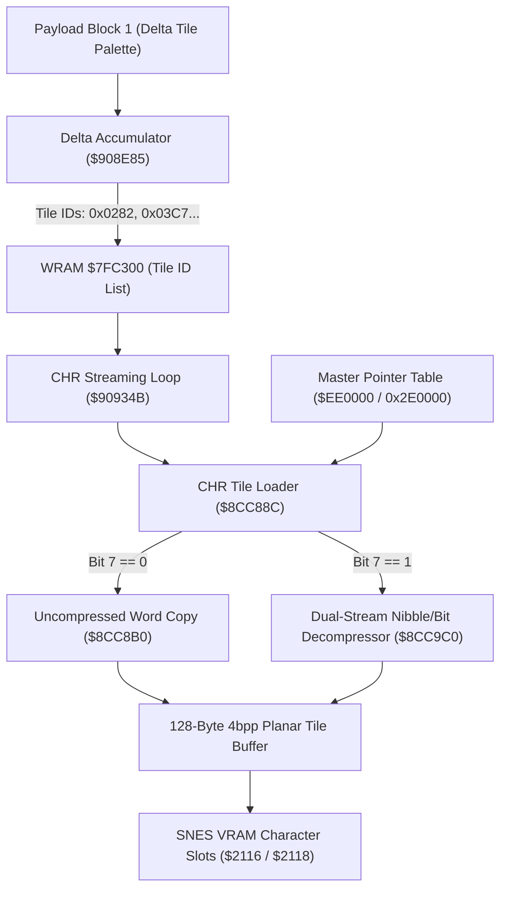

# Empirical Reverse Engineering: Secret of Evermore CHR Tile Graphics Decompression

> [!IMPORTANT]
> **Zero-Trust Trace Methodology**  
> All logic documented here is derived directly from 65c816 disassembly trace logs captured in Mesen2 and validated against `Secret of Evermore (U) [!]` (headerless 3,145,728 bytes).  
> Native engine routines: **`$8CC88C`** (master tile loader), **`$8CC9C0`** (compressed dual-stream decompressor), **`$8CCC40`** (16-mode jump table), and **`$90934B`** (CHR VRAM streaming loop).

---

## 1. Overview & Architectural Role

In Secret of Evermore, map visual art is constructed from an indexed library of **16×16-pixel metatile patterns** (character graphics). Rather than storing raw pixel grids for each map, the ROM stores a shared master character bank at ROM offset `0x2E0000` (`$EE0000` on the SNES bus).



During map loading:
1. **Block 1** decompresses into delta values at `$7FC300` and is accumulated into absolute **16-bit Master Tile IDs** (e.g. 97 unique tile IDs for Room `0x33`).
2. Subroutine **`$90934B`** loops through each tile ID and invokes **`$8CC88C`**.
3. **`$8CC88C`** resolves the tile pointer from `$EE0000`, decompresses the tile into exactly **128 bytes** (4 sub-tiles of 8×8 in 4bpp planar format), and streams it into SNES PPU VRAM.

---

## 2. Master Pointer Table (`$EE0000` / ROM `0x2E0000`)

The master pointer table begins at SNES address `$EE0000` (ROM file offset `0x2E0000`).
- **Stride:** Exactly **3 bytes** per tile ID (24-bit little-endian SNES address).
- **Index Formula:**
  $$\text{Table Pointer Address} = \text{0x2E0000} + (\text{tile\_id} \times 3)$$
- **Memory Mapping:** The 24-bit pointer is translated to a ROM file offset via standard SNES HiROM masking:
  $$\text{ROM File Offset} = \text{snes\_ptr} \ \& \ \text{0x3FFFFF}$$

### Disassembly: Pointer Lookup (`$8CC88C..$8CC8AB`)

```assembly
8CC88C: 8B          PHB                 ; Preserve data bank register
8CC88D: A6 2E       LDX $2E             ; Load destination VRAM address
8CC88F: 8E 16 21    STX $2116           ; Set PPU VRAM address register ($2116)
8CC892: 85 14       STA $14             ; Accumulator holds 16-bit tile_id
8CC894: 0A          ASL A               ; A = tile_id * 2
8CC895: 65 14       ADC $14             ; A = tile_id * 3
8CC897: AA          TAX                 ; X = table byte offset
8CC898: BF 00 00 EE LDA $EE0000,X       ; Read low 16 bits of 24-bit pointer
8CC89C: 85 12       STA $12             ; $12 = low 16 bits of data address
8CC89E: 7B          TDC                 ; Clear A
8CC89F: E2 20       SEP #$20            ; 8-bit accumulator
8CC8A1: BF 02 00 EE LDA $EE0002,X       ; Read bank byte (high 8 bits)
8CC8A5: 48          PHA
8CC8A6: AB          PLB                 ; Set Data Bank = tile data bank
8CC8A7: 85 14       STA $14
8CC8A9: B2 12       LDA ($12)           ; Read header byte (tileInfo)
8CC8AB: 10 03       BPL $8CC8B0         ; If Bit 7 == 0: Uncompressed branch
8CC8AD: 4C C0 C9    JMP $C9C0           ; If Bit 7 == 1: Compressed branch
```

---

## 3. Tile Format Header Byte (`tileInfo`)

The first byte at the resolved data address is the **tile control byte** (`tileInfo`):

| Bit | Field | Description |
|---|---|---|
| **Bit 7** | `compressed` | `0` = Uncompressed literal words; `1` = Dual-stream compressed |
| **Bits 6..0** | `dataOffset` / `wordCount` | If uncompressed: `word_count - 1`. If compressed: Byte offset where data stream begins. |

---

## 4. Uncompressed Tile Decoding (`Bit 7 == 0`)

If `tileInfo & 0x80 == 0`:
1. **Word Count:** Read `count = (tileInfo & 0x7F) + 1`. (Capped at 64 words = 128 bytes).
2. **Data Source:** Raw 16-bit words begin at `dataaddr + 1`.
3. **Copy:** Copy `count` words into the 128-byte destination buffer.
4. **Padding:** If `count < 64`, the **last word read is repeated** until all 128 bytes are filled.

---

## 5. Dual-Stream Compressed Decoding (`Bit 7 == 1`)

When `tileInfo & 0x80 != 0`, the tile is encoded as two concurrent streams interleaved in the ROM payload:

```
[tileInfo: 1B] [--- Command Nibble Stream (4-bit nibbles) ---] [--- Data Stream ---]
dataaddr       dataaddr + 1                                   dataaddr + (tileInfo & 0x7F)
```

1. **Command Stream (`cmdPtr`):** Starts at `dataaddr + 1`. Read as 4-bit nibbles (most significant nibble first, then least significant nibble).
2. **Data Stream (`dataPtr`):** Starts at `dataaddr + (tileInfo & 0x7F)`.

### 5.1 Bitstream Control Loop

The decompression loop processes 128 bytes (64 words):
1. Read 1 **Indicator Byte** from `dataPtr++`.
2. For each of the 8 bits (tested MSB-first, `bit 7` down to `bit 0`):
   - **If Bit == 0 (Uncompressed Literal):**  
     Read 1 word (2 bytes, little-endian) directly from `dataPtr` and write to output. `dataPtr += 2`.
   - **If Bit == 1 (Compressed Group):**  
     Read the next 4-bit nibble from `cmdPtr` as the **Compression Mode** (`0..15`). Dispatch via the mode table.
3. Repeat until `outPos >= 128`.

### 5.2 Compression Mode Table (`$8CCC40`)

The 16 modes are dispatched via the native jump table at `$8CCC40`:

| Mode | Address | Action / Output Word | Description |
|:---:|:---:|:---|---|
| **0** | `$CA44` | `0x0000` | Write 2 zero bytes (`[0x00, 0x00]`). |
| **1** | `$CA54` | `0x00FF` | Write bytes `[0xFF, 0x00]`. |
| **2** | `$CA66` | `0xFF00` | Write bytes `[0x00, 0xFF]`. |
| **3** | `$CA78` | `0xFFFF` | Write 2 `0xFF` bytes (`[0xFF, 0xFF]`). |
| **4** | `$CA8A` | `0x00**` | Byte `**` read from `dataPtr++`; write `[**, 0x00]`. |
| **5** | `$CAA0` | `0xFF**` | Byte `**` read from `dataPtr++`; write `[**, 0xFF]`. |
| **6** | `$CAB6` | `0x**00` | Byte `**` read from `dataPtr++`; write `[0x00, **]`. |
| **7** | `$CACD` | `0x**FF` | Byte `**` read from `dataPtr++`; write `[0xFF, **]`. |
| **8** | `$CB00` | `0x****` | Byte `**` read from `dataPtr++`; write `[**, **]` (duplicated byte). |
| **9** | `$CC00` | Repeat 1× | Repeat last written 16-bit word **1 time** (2 bytes). |
| **10** | `$CC0F` | Repeat 2× | Repeat last written 16-bit word **2 times** (4 bytes). |
| **11** | `$CC24` | Repeat 3× | Repeat last written 16-bit word **3 times** (6 bytes). |
| **12** | `$CB66` | Repeat (4 + N)× | Read next 4-bit nibble $N$ from `cmdPtr`; repeat last word **$4 + N$ times**. |
| **13** | `$CB4D` | `0x**RR` | Byte 0 = low byte of last written word; Byte 1 = byte from `dataPtr++`. |
| **14** | `$CB34` | `0xRR**` | Byte 0 = byte from `dataPtr++`; Byte 1 = high byte of last written word. |
| **15** | `$CB19` | `0x^^**` | Byte 0 = byte `**` from `dataPtr++`; Byte 1 = bitwise NOT (`** ^ 0xFF`). |

> [!NOTE]
> If a repeat mode (9–14) is triggered before any word has been written (`outPos < 2`), a fallback word of `0x0000` is used.

---

## 6. SNES 4bpp Planar Pixel Reconstruction

The 128 decompressed bytes represent a single **16×16-pixel metatile**, structured as **four 8×8 sub-tiles** (32 bytes each) arranged in a $2 \times 2$ grid:

```
+-------------------+--------------------+
| Sub-tile 0 (0..31)| Sub-tile 1 (32..63)|
| Top-Left (8x8)    | Top-Right (8x8)    |
+-------------------+--------------------+
| Sub-tile 2 (64..95| Sub-tile 3 (96..127|
| Bottom-Left (8x8) | Bottom-Right (8x8) |
+-------------------+--------------------+
```

### 6.1 Bitplane Layout within an 8×8 Sub-Tile (32 Bytes)

Each 8×8 sub-tile consists of 8 scanline rows ($r \in [0, 7]$). In SNES 4bpp format:
- **Bitplane 0:** Byte `r * 2 + 0`
- **Bitplane 1:** Byte `r * 2 + 1`
- **Bitplane 2:** Byte `r * 2 + 16`
- **Bitplane 3:** Byte `r * 2 + 17`

### 6.2 4-Bit Pixel Index Formula

For pixel column $x \in [0, 7]$ (where $x = 0$ is MSB, bit 7) and row $r \in [0, 7]$:
$$\text{bit\_mask} = 1 \ll (7 - x)$$
$$\text{pixel} = \left(\frac{b_0 \ \& \ \text{mask}}{\text{mask}}\right) \ | \ \left(\frac{b_1 \ \& \ \text{mask}}{\text{mask}} \ll 1\right) \ | \ \left(\frac{b_2 \ \& \ \text{mask}}{\text{mask}} \ll 2\right) \ | \ \left(\frac{b_3 \ \& \ \text{mask}}{\text{mask}} \ll 3\right)$$

The resulting value $\text{pixel} \in [0, 15]$ is the 4-bit color index within the active palette.

---

## 7. Flip Flags & VRAM Word Attributes

In the SNES VRAM tilemap words (Block 3 metatiles):
- **Bit 14 (`H-Flip`):** When set, mirrors the 16×16 metatile horizontally ($X' = 15 - X$).
- **Bit 15 (`V-Flip`):** When set, mirrors the 16×16 metatile vertically ($Y' = 15 - Y$).

---

## 8. Verified Reference Python Implementation

The following complete, standalone function decompresses any 16×16 CHR tile directly from ROM:

```python
def decompress_tile_16x16(rom: bytes, tile_id: int) -> bytes:
    """
    Decompresses a 16x16 metatile graphic (128 bytes, 4 sub-tiles of 8x8 in 4bpp)
    from the master $EE0000 table in Secret of Evermore ROM.
    """
    ptr_addr = 0x2E0000 + (tile_id * 3)
    data_addr = (rom[ptr_addr] | (rom[ptr_addr + 1] << 8) | (rom[ptr_addr + 2] << 16)) & 0x3FFFFF
    tile_info = rom[data_addr]

    decomp = bytearray(128)

    # Mode 1: Uncompressed
    if not (tile_info & 0x80):
        word_count = min((tile_info & 0x7F) + 1, 64)
        src = data_addr + 1
        decomp[:word_count * 2] = rom[src : src + word_count * 2]
        last_word = decomp[word_count * 2 - 2 : word_count * 2] if word_count > 0 else b"\x00\x00"
        for i in range(word_count * 2, 128, 2):
            decomp[i : i + 2] = last_word
        return bytes(decomp)

    # Mode 2: Dual-stream compressed
    data_offset = tile_info & 0x7F
    data_ptr = data_addr + data_offset
    cmd_ptr = data_addr + 1
    cmd_second_half = False
    out_pos = 0

    def read4() -> int:
        nonlocal cmd_ptr, cmd_second_half
        val = rom[cmd_ptr]
        if cmd_second_half:
            res = val & 0x0F
            cmd_ptr += 1
        else:
            res = (val >> 4) & 0x0F
        cmd_second_half = not cmd_second_half
        return res

    while out_pos < 128:
        indicators = rom[data_ptr]
        data_ptr += 1
        for _ in range(8):
            if not (indicators & 0x80):
                # Uncompressed word literal
                decomp[out_pos] = rom[data_ptr]
                decomp[out_pos + 1] = rom[data_ptr + 1]
                data_ptr += 2
                out_pos += 2
            else:
                mode = read4()
                if mode == 0:
                    decomp[out_pos : out_pos + 2] = b"\x00\x00"
                    out_pos += 2
                elif mode == 1:
                    decomp[out_pos : out_pos + 2] = b"\xFF\x00"
                    out_pos += 2
                elif mode == 2:
                    decomp[out_pos : out_pos + 2] = b"\x00\xFF"
                    out_pos += 2
                elif mode == 3:
                    decomp[out_pos : out_pos + 2] = b"\xFF\xFF"
                    out_pos += 2
                elif mode == 4:
                    decomp[out_pos] = rom[data_ptr]; data_ptr += 1
                    decomp[out_pos + 1] = 0x00
                    out_pos += 2
                elif mode == 5:
                    decomp[out_pos] = rom[data_ptr]; data_ptr += 1
                    decomp[out_pos + 1] = 0xFF
                    out_pos += 2
                elif mode == 6:
                    decomp[out_pos] = 0x00
                    decomp[out_pos + 1] = rom[data_ptr]; data_ptr += 1
                    out_pos += 2
                elif mode == 7:
                    decomp[out_pos] = 0xFF
                    decomp[out_pos + 1] = rom[data_ptr]; data_ptr += 1
                    out_pos += 2
                elif mode == 8:
                    v = rom[data_ptr]; data_ptr += 1
                    decomp[out_pos] = v
                    decomp[out_pos + 1] = v
                    out_pos += 2
                elif 9 <= mode <= 12:
                    count = (mode - 9 + 1) + (read4() if mode == 12 else 0)
                    for _ in range(count):
                        if out_pos < 2:
                            decomp[out_pos : out_pos + 2] = b"\x00\x00"
                        else:
                            decomp[out_pos] = decomp[out_pos - 2]
                            decomp[out_pos + 1] = decomp[out_pos - 1]
                        out_pos += 2
                        if out_pos >= 128:
                            break
                elif mode == 13:
                    prev = decomp[out_pos - 2] if out_pos >= 2 else 0
                    decomp[out_pos] = prev
                    decomp[out_pos + 1] = rom[data_ptr]; data_ptr += 1
                    out_pos += 2
                elif mode == 14:
                    decomp[out_pos] = rom[data_ptr]; data_ptr += 1
                    prev = decomp[out_pos - 1] if out_pos >= 2 else 0
                    decomp[out_pos + 1] = prev
                    out_pos += 2
                elif mode == 15:
                    v = rom[data_ptr]; data_ptr += 1
                    decomp[out_pos] = v
                    decomp[out_pos + 1] = v ^ 0xFF
                    out_pos += 2

            if out_pos >= 128:
                break
            indicators = (indicators << 1) & 0xFF

    return bytes(decomp)


def decode_tile_pixels(tile_bytes: bytes, hflip: bool = False, vflip: bool = False) -> list[list[int]]:
    """
    Converts 128-byte 4bpp planar tile into a 16x16 2D array of palette color indices (0..15).
    """
    assert len(tile_bytes) == 128
    pixels = [[0] * 16 for _ in range(16)]

    # 4 sub-tiles: (0,0)=top-left, (1,0)=top-right, (0,1)=bottom-left, (1,1)=bottom-right
    for sub_y in range(2):
        for sub_x in range(2):
            sub_idx = sub_x + (sub_y * 2)
            base = sub_idx * 32
            for row in range(8):
                b0 = tile_bytes[base + row * 2 + 0]
                b1 = tile_bytes[base + row * 2 + 1]
                b2 = tile_bytes[base + row * 2 + 16]
                b3 = tile_bytes[base + row * 2 + 17]
                for col in range(8):
                    mask = 1 << (7 - col)
                    p = ((1 if b0 & mask else 0) |
                         ((1 if b1 & mask else 0) << 1) |
                         ((1 if b2 & mask else 0) << 2) |
                         ((1 if b3 & mask else 0) << 3))
                    px = (sub_x * 8) + col
                    py = (sub_y * 8) + row
                    out_x = 15 - px if hflip else px
                    out_y = 15 - py if vflip else py
                    pixels[out_y][out_x] = p

    return pixels
```

---

## 7. Dynamic Animated Tiles (Section 2 Streaming)

In addition to the static tile palette defined in **Block 1**, 95 rooms in Secret of Evermore feature animated background elements (such as water waves, lava bubbles, rotating fans, guard faces, torch flames, light rays, and stone wall mechanisms).

### 7.1 ROM Payload Structure

Immediately following the compressed/uncompressed payload of Block 1 lies **Section 2**:

$$\text{Section 2 ROM Offset} = \text{Block 1 Offset} + \text{Block 1 Payload Length}$$

```
[sec2_count: 1B] [sec2_len: 2B] [--- Animation Channel Descriptors (sec2_count * 4B) ---] [--- Frame Streams ---]
```

1. **Header (3 Bytes)**:
   - `sec2_count` (1 byte): Number of active animation channels.
   - `sec2_len` (2 bytes, little-endian): Total byte length of Section 2.
2. **Channel Descriptor Table (`sec2_count * 4` bytes)**:
   - Each entry is 4 bytes: `[delay: 1B] [timer: 1B] [offset: 2B (little-endian)]`.
   - `offset` is relative to the start of Section 2 and points to the channel's animation frame sequence.
3. **Animation Frame Sequences**:
   - Sequence of `[delay: 1B] [tile_id: 2B (little-endian)]`.
   - Terminated by byte `0xFF`.
   - **Frame 0**: The first `tile_id` in the stream provides the default visual state decompressed from `$EE0000`.

### 7.2 Palette Extension & VRAM Indexing

During room initialization, the engine appends the Frame 0 tile IDs from all `sec2_count` channels directly to the end of the Block 1 tile palette in WRAM (`$7FC300`):

$$\text{Master Tile ID}[k] = \begin{cases} \text{Block 1 Palette}[k], & 0 \le k < \text{len(Block 1)} \\ \text{Animated Frame 0}[k - \text{len(Block 1)}], & \text{len(Block 1)} \le k < \text{Total Tiles} \end{cases}$$

Every animated tile is decompressed using the exact same **`$8CC88C`** routine into SNES PPU VRAM, allowing the map tilemap to reference these dynamic tiles seamlessly.

---

## 8. Related Documentation
- [Map Rendering Pipeline](map_rendering_pipeline.md): End-to-end Mode 1 priority assembly, color math, and PNG export.
- [Map Palette Extraction](map_palette_extraction.md): Empirical CGRAM color decoding from tile families at `$9CC322`.
- [Map Decompression Trace Analysis](map_decompression_trace_analysis.md): Payload Blocks 1, 2, 3 and VRAM grid assembly.


