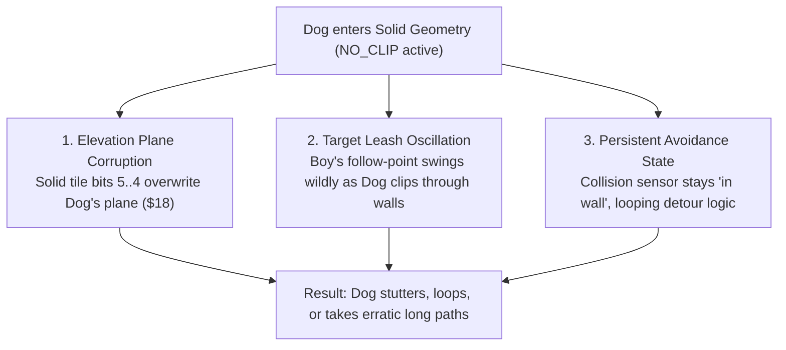
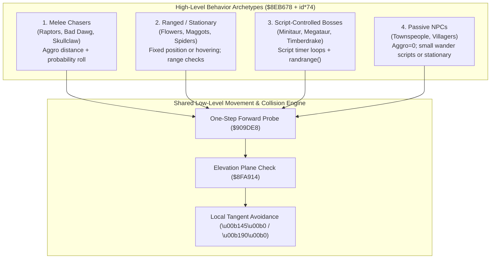

# NPC & Enemy Pathfinding, Obstacle Navigation, and AI Mechanics

This document provides a technical and reverse-engineered explanation of how NPCs, enemies, and companion AI (the Dog) navigate maps, how path choices are made, how collision flags affect routing, and why specific pathing quirks (such as the no-clip dog or enemies freezing) occur in *Secret of Evermore*.

---

## 1. Executive Summary & Core Realities

| Question | Core Engine Reality |
|---|---|
| **Do NPCs use global pathfinding (A*, Dijkstra, NavMesh)?** | **No.** The SNES 65c816 CPU and RAM constraints prohibit dynamic whole-map graph search. There are no pre-calculated waypoint graphs in room blobs (proven in [**`docs/npc_movement_and_waypoints.md`**](file:///Users/v/Documents/GitHub/everscript/docs/npc_movement_and_waypoints.md)). |
| **How do entities decide which path to take?** | Movement is driven by a **reactive local steering vector** directed at the target (player or script coordinate), combined with a **local obstacle wall-following heuristic** when blocked. |
| **Why do they take longer paths around big obstacles?** | Because routing is purely local "wall-hugging" (a simple Bug algorithm). When an obstacle blocks the direct line-of-sight vector, the entity turns perpendicular and traces the barrier's perimeter until clear, often circumnavigating large obstacles the long way. |
| **How does the `NO_CLIP` flag influence pathing?** | `NO_CLIP` bypasses physical coordinate clamping, but **does not bypass the AI state machine**. The AI continues running its obstacle-circumvention loops, gets confused by invalid elevation planes in solid geometry, and suffers target-angle oscillations. |
| **Why do enemies stop chasing when you stand on their target tile?** | Hitbox overlap blocking prevents reaching the exact target coordinate, minimum attack range constraints inhibit attacks, and standing on entity gates or plane boundaries invalidates the target tile. |

---

## 2. Path Decision Architecture: Local Steering vs. Global Search

### 2.1 The Two Modes of Movement
Movement orders in Evermore originate from two distinct sources:
1. **Script Orders:** High-level opcodes (`0x6c` `TILE_ABSOLUTE`, `0x6d` `TILE_RELATIVE`, `0x9d` `COORDINATE_ABSOLUTE`) that command an entity to reach a single destination point at a time.
2. **Autonomous Engine AI:** Combat and companion behavior loops that run once per frame for active entities in WRAM (`$7E3DE5..$7E4E88`).

### 2.2 The Line-of-Sight Steering Loop
For both script-commanded entities and enemies chasing the player, the engine executes a continuous frame-by-frame steering routine:
1. **Target Delta Calculation:**
   $$\Delta X = X_{target} - X_{current}, \quad \Delta Y = Y_{target} - Y_{current}$$
2. **Primary Vector:** The entity determines its primary heading (cardinal or diagonal) based on the signs and relative magnitude of $\Delta X$ and $\Delta Y$.
3. **One-Step Forward Probe:** The engine reads the metatile collision word (Slice 2, `$7F0000 + base + (id \times 8) + 4`) for the prospective tile step and evaluates passability via `$909DE8` (see [**`docs/map_collision_mechanics.md`**](file:///Users/v/Documents/GitHub/everscript/docs/map_collision_mechanics.md)).
4. **Step Execution:** If the tile is passable for the entity's current elevation plane (`$44` / `+$18`), velocity is applied and the entity moves forward.

---

## 3. Why Enemies Take Longer Paths Around Big Obstacles

Because the engine lacks a global path graph, it cannot "look ahead" across the map to find the globally optimal shortcut around terrain.

```
                    [TARGET: Player]
                           ▲
                           │
                 ┌─────────┴─────────┐
                 │                   │
                 │   LARGE OBSTACLE  │
                 │   (Rock / Lake)   │
                 │                   │
                 └─────────┬─────────┘
                           │ ◄── Blocked!
                           │
                     [Enemy / NPC]
             (Turns left or right into wall-hugging)
```

### 3.1 The Local Wall-Tracing Heuristic (Bug Algorithm)
When the forward probe encounters solid collision (`$909DE8` returns solid geometry `0x0F` or plane mismatch):
1. **Obstacle Deflection:** The entity branches into an obstacle-avoidance state. It attempts alternate test probes at $\pm 45^\circ$ and $\pm 90^\circ$ relative to its original heading.
2. **Commitment to a Hand Rule:** Once a passable tangent is found (e.g. clockwise around the obstacle), the entity enters a wall-following mode, attempting to keep the obstacle to one side while stepping forward.
3. **The "Long Way Around":**
   - If an entity encounters a wide barrier (e.g., a cliff wall or jungle pond), turning clockwise might take it 20 tiles out of the way, whereas turning counter-clockwise would have required only 3 tiles.
   - The entity does not evaluate the total perimeter length; it simply commits to the first passable detour direction and hugs the contour until its line-of-sight vector to the player is clear again.
4. **Elevation Plane Traps:** If an obstacle contains elevation plane changes (planes 0, 1, 2, 3), the entity cannot step onto tiles with mismatched plane bits. It is forced to follow the contour until it reaches a valid plane transition ramp.

---

## 4. The `NO_CLIP` Paradox: Why the No-Clip Dog Struggles

When the `NO_CLIP` attribute bit is enabled (`ATTRIBUTE_FLAGS.FLAGS_2 & 0x04` at `entity + 0x11`), one might expect the Dog to take a beeline directly to the Boy. In practice, players observe that the no-clip Dog often wanders erratically or has trouble reaching the destination.

### 4.1 Physical Movement vs. AI State Machine
`NO_CLIP` is a **physics override**, not an **AI override**:
- **What `NO_CLIP` does:** In the low-level movement execution routines (`$8FA...`), the engine skips position-rejection and wall pushback. Coordinates are allowed to update regardless of tile solidity.
- **What `NO_CLIP` does NOT do:** It does **not** disable the companion AI logic, follow state machine, or obstacle avoidance heuristics.

### 4.2 Why Pathing Degrades with `NO_CLIP`:



1. **Elevation Plane Corruption (`$8FA914`):**
   - The engine updates the entity's active elevation plane (`$44` / `entity + 0x18`) from bits 5..4 of the current tile whenever passing over tiles that are not plane-transparent or drift tiles.
   - In solid void or interior rock tiles, the collision word often contains random or mismatched plane bits (e.g., plane 0 or plane 3).
   - Once the Dog's internal plane is corrupted by walking inside a wall, the AI evaluates normal walkable floor tiles outside the wall as **solid plane mismatches** (`$909E2D -> $909E64 solid`), triggering avoidance behavior against open ground!
2. **Follow-Point Angular Swings:**
   - The Dog AI does not target the exact pixel of the Boy; it targets an offset leash point (e.g. 24–32 pixels behind or beside the Boy, depending on `FACE_DIRECTION`).
   - When clipping directly through walls at full speed, the Dog rapidly cuts across the Boy's turning axes. As the Boy changes direction, the target coordinate flips across the wall, causing the Dog to abruptly reverse direction, oscillate, or circle.
3. **Obstacle-Avoidance State Latching:**
   - If the AI entered an obstacle-detour state when approaching the wall, the state machine waits for the forward probe to return "passable" before returning to direct chase mode.
   - Because the Dog is physically moving *inside* solid collision tiles, every forward probe returns solid, keeping the avoidance state latched even though the sprite is moving forward.

### 4.3 Why the Vanilla Dog Navigates Stairs Cleanly (Without Getting Stuck)

A natural question arises: *If obstacle avoidance is so prone to perimeter detours, why does the vanilla Dog run up staircases to the Boy without getting stuck?*

The seamless behavior is due to three specific engine systems working in harmony:

1. **Stairs Are Contiguous Passable Corridors, Not Obstacles:**
   - In the ROM map data, stairs are **not** solid walls that the AI has to "navigate around". They are constructed with **Plane-Transparent tiles (Bit 6)** and contiguous **Plane Transition metatiles**.
   - As decoded in routine `$909E44` ([**`docs/map_collision_mechanics.md`**](file:///Users/v/Documents/GitHub/everscript/docs/map_collision_mechanics.md)), when an entity approaches a plane-transparent tile from any plane, the evaluator returns `TDC` ($A = 0$, **fully open/passable**).
   - As the entity steps onto the stair threshold, routine `$8FA914` updates the active plane register (`$44` / `entity + 0x18`) to match the new elevation level.
   - To the forward collision sensor, a staircase is an **unobstructed open corridor**. The Dog does not need to solve an obstacle puzzle because no solid barrier exists on the stairs.
2. **Companion Breadcrumb Leashing vs. Raw Enemy Homing:**
   - Unlike generic enemies that blindly draw a straight-line Euclidean vector to $(X_{player}, Y_{player})$, the companion Dog AI tracks the **Boy's recent movement history (breadcrumbs)**.
   - When the Boy navigates a narrow winding staircase, around a balustrade, or across a bridge, the Dog does not home toward the Boy's coordinates through the railing; it targets the path coordinates the Boy just traversed.
3. **Catch-Up Sprint & Rubber-Banding (`FLAGS_6 & 0x08`):**
   - If the Boy sprints up multiple flights of stairs and increases the distance gap, the engine triggers the Dog's catch-up sprint (`AI_RUN`, `FLAGS_6 & 0x08`), increasing the Dog's movement speed.
   - If extreme separation occurs (e.g. companion gets wedged behind an entity or off-screen), the engine's companion manager triggers a reposition snap, ensuring the companion never stays permanently lost.
4. **Why `NO_CLIP` Actually Degrades This Elegance:**
   - In normal gameplay, physical collision forces the Dog to stay on the designated staircase (the valid plane transition path).
   - With `NO_CLIP`, however, the Dog can cut straight through the solid cliff/mountain adjacent to the stairs.
   - Inside the solid mountain, the Dog bypasses the plane-transparent transition tiles. It absorbs whatever uninitialized or mismatched plane bits reside inside the solid geometry. When it emerges onto the upper floor, its active plane ($44) no longer matches the upper floor, causing open ground to be evaluated as solid!

---

## 5. Why Enemies Stop Chasing When You Stand on Their Destination Tile

Players frequently observe an enemy charging toward them, only to abruptly freeze, idle, or turn around when the player stands directly on the tile the enemy was approaching.

### 5.1 Hitbox Collision & Overlap Deadlock
- **Entity Hitbox vs. Tile Center:** Each entity possesses an active collision box (defined in its sprite descriptor). The player and enemies cannot occupy the exact same physical coordinates without triggering separation pushback.
- **The "Distance == 0" Trap:**
  - An enemy's pathing logic frequently commands it to reach the center of a specific metatile (e.g., `(tile_x * 16 + 8, tile_y * 16 + 8)`).
  - When the player stands on that tile, the player's physical hitbox blocks the enemy from reaching the exact center pixel.
  - The enemy's movement velocity is stopped by entity collision, but because it has not yet reached the arrival threshold, it cannot set `AI_FOLLOWING_REACHED` (`FLAGS_3 & 0x01`). It becomes stuck in an infinite forward push against the player without triggering its arrival action.

### 5.2 Minimum Attack Range Constraints
- Many enemy AI scripts (configured in the 74-byte stat table at `$8EB678`) have a **minimum attack distance**:
  - Ranged enemies (e.g., Spit Flowers, Spiders) and charging enemies (e.g., Minitaurs, Raptors) require a distance window (e.g., $D > 32$ pixels) to execute their attack animations.
  - If the player closes the gap and stands directly on the enemy's destination tile ($D \approx 0$), the enemy's attack condition evaluates to `FALSE`.
  - With attack inhibited and forward movement blocked, the AI enters an idle cycle or attempts to step backward to restore range.

### 5.3 Entity Gate & Boundary Invalidation
- Certain tiles contain **Entity Gates** (bits 11..8 of the collision word, see [**`docs/map_collision_mechanics.md`** §4](file:///Users/v/Documents/GitHub/everscript/docs/map_collision_mechanics.md#4-entity-gates-bits-118)):
  - Nibble `0x7`: Passable for enemies, solid for the Boy and Dog.
  - Nibble `0x3`: Passable for the Boy and Dog, **solid for enemies**.
- If the player stands on a tile that is gated against enemies, or on an elevation boundary, the enemy's target evaluation routine detects the prospective target tile as impassable for its entity type, terminating the aggro chase and reverting the enemy to a stationary idle state.

---

## 6. Do All Enemies Use the Same Algorithm?

**No, but they share the same low-level steering and collision primitive.**

The engine divides entity movement into a common low-level execution layer and distinct high-level AI behavior archetypes:



1. **Shared Foundation (Layer 1):**
   - Every moving entity (Boy, Dog, NPCs, regular mobs, bosses) uses the exact same collision evaluator (`$909DE8`), elevation plane register (`$44` / `+$18`), and sub-tile geometry masks.
2. **Behavior Archetypes (Layer 2):**
   - **Melee Pursuers:** Continuously test vector distance to the player against `aggro_range` (`+$13`). When in range and an `aggro_chance` roll passes, they home in with obstacle deflection.
   - **Ranged / Artillery:** Stationary or slow drifters. They do not pursue; they periodically check line-of-sight and fire projectiles (`shoot_entity_absolute`).
   - **Airborne / Phasing Entities:** Flying entities (e.g. Mosquitos, Buzzards) have `FLAG_ENEMY.PHASING` (`0x0400`) set, skipping ground barrier and elevation checks.
   - **Script-Driven Bosses:** Complex bosses (like Minitaur or Megataur) do not rely purely on engine AI; their movement loops in `script_all` execute scripted timers, stochastic pause steps (`arg0 = arg0 + 1 + (RAND & 1)`), and explicit walk commands (`0x6c`, `0x6d`, `0x9d`).

---

## 7. Determinism vs. Randomness: Same Frame, Same Route?

> **Question:** If an NPC always starts on the exact same frame, does it always take the same route?

### 7.1 The Theoretical Answer (TAS Determinism): **Yes**
Secret of Evermore is a deterministic 65c816 state machine. If you run the game in an emulator from a save state where:
1. The global frame counters (`$7E0100`, `$7E0102`) match,
2. The internal PRNG seed in RAM is identical,
3. The player inputs and positions are reproduced frame-for-frame,
...then **every enemy will take the exact same route and make identical detour choices**. There is no true hardware randomness.

### 7.2 The Real-Time Gameplay Reality: **No (High Stochastic Variance)**
In live gameplay, enemies almost never take the identical route across attempts, because the routing decision is tightly coupled to several stochastic factors:

1. **Global PRNG Advancement:**
   - The engine's Linear Congruential PRNG advances on player button presses, combat roll checks, damage calculations, and animation frames. Even a 1-frame difference in swinging a sword or opening a ring menu shifts the entire random seed stream.
2. **The `aggro_chance` Roll (`+$15`):**
   - In the character stat table (`$8EB678`), combat entities have an `aggro_chance` byte (e.g., `0x32` / 50 out of 256 for Skullclaws, `0x64` / 100 for Boy, `0xFF` for Bad Dawg).
   - In each AI cycle, the entity rolls `RAND < aggro_chance`. If the roll fails on frame $N$, pursuit delays until frame $N+k$, changing the initial encounter position.
3. **Detour Tangent Tie-Breaking:**
   - When an obstacle directly faces the pursuer ($\Delta X = 0$ or $\Delta Y = 0$), the choice of whether to turn clockwise ($+90^\circ$) or counter-clockwise ($-90^\circ$) uses a PRNG bit or low frame counter bit. A 1-frame difference sends the entity around the opposite side of the obstacle!
4. **Player Position Coupling:**
   - Because the target vector $(\Delta X, \Delta Y)$ is relative to the player, if the player is shifted by even a single pixel ($1$ px) at the moment the enemy hits the wall, the tangent angle calculation flips, drastically altering the path around a large obstacle.

---

## 8. ROM Hacking & Everscript Implications

1. **Guiding NPCs Reliably in Cutscenes:**
   - Never rely on default AI to navigate around complex geometry.
   - Use `walk(character, x, y, WALK_TYPE.COORDINATE_ABSOLUTE_DIRECT)` (`0x73`) or temporary `NO_CLIP` for automated cutscene movements where obstacles might otherwise deflect the path.
2. **Preventing AI Leash Exploits:**
   - In boss arenas or puzzle rooms, ensure step-on triggers use sufficiently wide bounding boxes so that companion pathfinding cannot traverse the boundary undetected.
3. **Designing Passable Arenas:**
   - Avoid narrow 1-tile elevation ramps in combat zones; enemy wall-following heuristics frequently get stuck on elevation transition corners when chasing the player.

